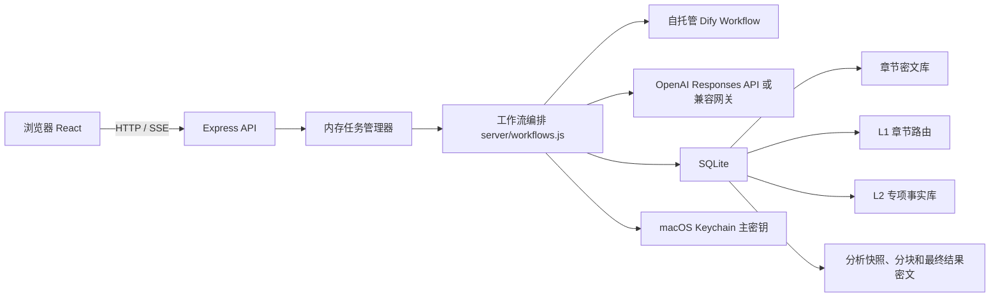

# 小说章节安全分析台：项目基线

> 历史告示：本文记录重构前的单机 SQLite 应用，不代表当前重构项目状态
>
> 当前基线、决策和任务进度以 [docs/project/PROJECT.md](project/PROJECT.md) 为唯一入口

最后核验：2026-07-15，Asia/Shanghai

本文档是项目级控制基线，目标是让没有历史对话上下文的开发者或 Agent 在一次阅读后能够完成以下工作

- 正确启动并使用系统
- 理解章节导入、L1、L2、Analysis 和结果展示之间的协作关系
- 知道哪些数据被加密、哪些状态可恢复、哪些调用会访问外部模型
- 根据任务 ID、运行日志和追踪字段定位问题
- 在不破坏现有语义的前提下规划重构或扩展

本文档描述的是当前实现，不是理想架构。建议和未落实事项会明确标记为“后续计划”

## 1. 项目身份与边界

| 项目 | 当前基线 |
| --- | --- |
| 产品名称 | Novel Chapter GPT Service / 小说章节安全分析台 |
| 正式工作区 | `/Users/staff/Desktop/Vibe coding/novel-chapter-gpt-service` |
| 远程仓库 | `git@github.com:fuer121/Dify-Flow.git` |
| 默认分支 | `main` |
| 当前工作分支 | `codex/UI-redesign` |
| 当前工作提交 | `5a69372 fix l2 query stale index handling` |
| 当前主分支提交 | `origin/main` 为 `7a16646` |
| 产品形态 | 本地运行、可信局域网访问的单用户工具 |
| 核心存储 | 本地 SQLite + macOS Keychain 主密钥 |

工作区约束

- 唯一正式开发与运行目录是当前工作区
- 历史重复工作区不能继续承载代码或文档真相
- `data/` 是正式数据库，`data-preview/` 是预览快照，两者不能混用
- 当前工作区存在未提交的本地产物，包括 `.DS_Store`、部分 Dify YAML、`output/`、`tmp/` 和生成脚本，除非任务明确要求，否则不要自动纳入提交
- 当前分支比 `origin/main` 多一笔尚未合并的 L2 失效索引处理修复，基于主分支开展新工作前应先确认 PR 合并状态

## 2. 产品目标与非目标

### 2.1 产品目标

- 通过 Dify Workflow 分批获取小说章节，章节正文只导入一次
- 章节正文立即加密落本地 SQLite，后续分析复用本地章节库
- 通过 L1 章节路由和多个 L2 专项事实索引降低长篇小说重复分析成本
- 支持完整分析模板和轻量 L2 自然语言提问两类使用方式
- 保存任务级 Prompt、Schema、分块结果和诊断信息，允许失败后继续执行
- 将版权正文、Prompt 和分析结果尽量限制在本地受控边界

### 2.2 当前非目标

- 不是公网 SaaS，不包含账号、权限、租户和公网鉴权
- 不提供章节正文阅读器，前端只展示章节元数据
- 不使用 OpenAI Files、Vector Stores、Assistants、Threads、Batch 或 background mode
- L2 提问不是原文搜索，它只查询已完成的 L2 facts
- 当前没有向量检索或 embeddings，召回主要依赖结构字段、关键词、别名和本地评分
- 当前没有多进程任务调度、分布式队列或多实例数据库写入能力

## 3. 新 Agent 快速接手

### 3.1 首次阅读顺序

1. 阅读本文件，确认当前系统边界和已知问题
2. 阅读 `README.md`，了解用户侧启动与操作入口
3. 阅读 `docs/L1_L2_INDEX_STORAGE.md`，理解索引表和新鲜度规则
4. 阅读 `server/index.js`，确认真实 API 面
5. 阅读 `server/workflows.js` 中与任务相关的单条链路，不要从头线性阅读整个文件
6. 阅读 `server/db.js` 对应的数据读写函数
7. 从 `test/service.test.js` 中搜索相关测试名，测试通常比旧文档更接近真实行为

### 3.2 开始修改前必须确认

```bash
git status --short --branch
git log -1 --oneline
git fetch origin
git log --oneline --decorate -5 origin/main
```

同时确认运行环境

```bash
curl -s http://127.0.0.1:5184/api/health
curl -s http://127.0.0.1:5184/api/diagnostics
```

端口不是固定真相。代码默认后端端口是 `5174`，当前正式服务实际运行在 `5184`，应以进程和 `/api/health` 为准

### 3.3 最小验证

```bash
npm test
npm run lint
npm run build
git diff --check
```

针对局部修改，先运行带 `--test-name-pattern` 的目标测试，再运行全量验证

## 4. 系统总览



系统的核心不是单次模型调用，而是四层可复用数据管线

```text
章节密文库 -> L1 章节路由 -> L2 专项事实库 -> Analysis 最终产物
```

- 章节库是原始事实边界，只导入一次
- L1 回答“哪些章节可能相关”
- L2 回答“这些章节有哪些可复用事实”
- Analysis 根据具体任务召回、复核、分块、汇总和展示

## 5. 核心模块责任

| 模块 | 责任 | 关键文件 |
| --- | --- | --- |
| 前端壳与全局任务 | 路由、基础数据加载、长任务状态上提、SSE 订阅 | `src/App.jsx` |
| 分析工作台 | 模式选择、章节范围、模板或索引选择、历史、结果、任务 ID、追踪和下载 | `src/pages/AnalysisPage.jsx` |
| 书籍库 | 书籍创建、章节导入、L1/L2 构建与覆盖率 | `src/pages/LibraryPage.jsx` |
| Prompt 管理 | 书籍级模板、L1 规则、L2 索引组规则 | `src/pages/PromptLibraryPage.jsx` |
| 诊断页 | 运行配置、数据库计数和任务概览 | `src/pages/DiagnosticsPage.jsx` |
| HTTP API | 参数接收、任务启动、结果查询、静态文件托管和错误脱敏 | `server/index.js` |
| 任务状态机 | 内存任务、暂停、继续、取消、进度估算和 SSE 广播 | `server/tasks.js` |
| 业务编排 | 导入、L1、L2、四类 Analysis、召回、预算、分块、merge 和恢复 | `server/workflows.js` |
| 数据访问 | SQLite schema、运行时迁移、加密读写、覆盖率和快照 | `server/db.js` |
| 加密 | AES-256-GCM、HMAC-SHA256、Keychain 主密钥 | `server/crypto.js` |
| Dify 适配 | Workflow 请求、短重试、输出 envelope 归一化和错误目标标识 | `server/dify.js` |
| OpenAI 适配 | Responses API、ZDR 形态、代理、重试、SSE/混合响应解析和 JSON 修复 | `server/openai.js` |
| Schema 与导出 | JSON Schema、结果表格推断和 Excel XML 工作簿 | `server/schema.js`、`src/schemaTools.js` |
| Prompt 引导 | L1/L2/Analysis Prompt 创建和优化建议 | `server/promptGuides.js` |

## 6. 三条基础建设链路

### 6.1 章节导入

1. 用户选择书籍 ID、书名和章节范围
2. `POST /api/books/imports` 创建内存任务
3. 后端按 `IMPORT_BATCH_SIZE` 切分章节范围
4. 导入前使用目标 API Key 对 Dify 做连通性预检
5. `minimal-chapter-fetch` Workflow 返回章节 JSON，不运行 LLM 分析
6. 后端对正文计算 HMAC，使用 AES-256-GCM 加密并写入 `chapters`
7. 已存在且未强制刷新的章节跳过，不重复回源

关键约束

- 同一 `book_id` 不能绑定不同书名
- 章节正文不写普通文件、不写日志、不写浏览器 localStorage
- Dify 导入工作流只负责章节获取，不承担索引或分析

### 6.2 L1 章节路由

1. `POST /api/books/:bookId/l1-indexes` 创建任务
2. 每章检查正文 HMAC、L1 Prompt hash 和执行签名
3. 仅对缺失、过期或明确强制刷新的章节执行
4. 调用 Dify 或 OpenAI 生成轻量 route entities、keywords、signals 和 category scores
5. 结果写入 `l1_chapter_indexes`

L1 的职责是路由，不是摘要或事实百科

- 应保持短、稳定、可检索
- 不应沉淀深度人物设定或完整事件事实
- `l1_window_indexes` 只为兼容和诊断保留，不是当前主构建路径

### 6.3 L2 专项事实索引

1. 每本书可创建多个 `book_index_groups`
2. 每个索引组有独立名称、范围、触发词、L2 Prompt 和启用状态
3. `POST /api/books/:bookId/l2-indexes` 按章节和索引组执行
4. 输入包含章节原文和可用的紧凑 L1 路由
5. 输出标准化为类型化 facts，保存章节状态和事实记录
6. fact/evidence/review_note 加密，检索所需元数据明文保存

专项索引可以在 `category_scope` 声明扩展类别。当前已支持 `magical_creature`：这类组要求模型提供明确的专项资格依据，后端只接收通过资格校验的 facts，并统一按 `magical_creature` 入库，避免普通人物或普通器物仅靠 Prompt 标签混入专项事实库

L2 支持 `all`、`missing`、`retry_failed` 构建模式。定向模式不会因为 `force` 意外重建整个范围

模式与 `force` 的优先级

- `retry_failed` 只执行已有状态为 failed 的章节，其他章节跳过，`force` 不扩大范围
- `missing` 只执行完全没有 L2 status 的章节，已有 completed 或 failed 记录都跳过，`force` 不扩大范围
- `all` 默认跳过新鲜 completed 章节，只有 `all + force` 才重跑范围内所有章节

标准 L2 fact 字段

- 检索元数据：`category`、`entity`、`aliases`、`tags`、`related_entities`、`fact_type`、`importance`、`confidence`、`review_source`
- 加密内容：`fact`、`evidence`、`review_note`
- 来源与新鲜度：`book_id`、`index_group_key`、`chapter_index`、`source_hmac`、`model`、`prompt_hash`、`schema_version`

## 7. Analysis 运行逻辑

### 7.1 共用准备阶段

所有 Analysis 都走 `POST /api/analyses`

1. 校验书籍、章节范围和具体章节选择
2. 解析 `analysis_mode`
3. 解析分析模板绑定的 L2 索引，或读取 `l2_query` 直接传入的索引组
4. 过滤或拒绝不存在、已禁用的索引组
5. 生成任务级 Prompt/Schema/模式/索引快照并加密保存
6. 创建 `analysis_runs`，任务 ID 与 analysis ID 相同
7. 根据模式进入不同执行链路

任务历史中的“复制”使用快照恢复配置。当前分支会过滤历史任务里已经失效的索引 key，避免新任务提交后才报错

### 7.2 模式对照

| 模式 | 读取 L1 | 读取 L2 | 读取原文 | 最终输出 | 适用场景 |
| --- | --- | --- | --- | --- | --- |
| `l2_query` | 否 | 是 | 否 | Markdown | 小模块设定问答、时间线、事实清单、排行 |
| `fast_index` | 是 | 是 | 否 | 模板定义的 JSON 或文本 | 快速探索，成本最低 |
| `balanced` | 是 | 是 | 最多约 1%，3 至 10 章 | 模板定义的 JSON 或文本 | 默认推荐，速度与忠实度平衡 |
| `precision` | 是 | 是 | 最多约 3%，5 至 30 章 | 模板定义的 JSON 或文本 | 重要设定，需要更多原文复核 |
| `full_text` | 仅在 `use_l1_context=true` 时作为逐章 Prompt 附加上下文 | 不消费，但当前创建任务仍要求模板绑定可用索引组 | 是，逐章 | 模板定义的 JSON 或文本 | 索引不足或需要逐章精读 |

用户可以覆盖 `balanced` 和 `precision` 的原文复核预算。`l2_query` 的原文复核始终为 0

### 7.3 全文精读 `full_text`

1. 按章节读取并解密正文
2. 如果任务设置 `use_l1_context=true`，将对应章节的紧凑 L1 信息附加到逐章 Prompt
3. 调用 `analysis_chapter` 得到结构化逐章结果
4. 逐章结果加密写入 `analysis_chapters`
5. 逐章结果按章节排序后进入最终汇总
6. 汇总结果写入 `analysis_summary_parts` 和 `analysis_runs`

`full_text` 执行本身不读取 L2 facts。当前仍要求 Analysis 模板绑定至少一个有效事实索引，这是创建阶段的统一校验约束，不是运行依赖

复用条件同时包含正文 HMAC、Prompt hash 和 Analysis chapter 执行签名。切换模型、Provider 或 Dify 工作流版本后不会误用旧逐章结果

### 7.4 索引分析 `fast_index / balanced / precision`

1. 从 summary Prompt 推断目标主体、实体查询和 L2 分类
2. 扫描新鲜 L1 route，优先选出相关章节
3. 从模板绑定的一个或多个 L2 索引组召回 facts
4. L1 未命中或召回过少时走范围兜底，分类筛空时可去分类重试
5. `balanced / precision` 按预算选择高风险章节做原文复核
6. 将 L2 facts 和复核 facts 组织成 evidence packets
7. 按最终 Schema 选择整体汇总或顶层字段拆分汇总
8. 保存 source stats、trace、分块和最终结果

目标主体设定集会优先保留目标 facts，避免其他同类实体稀释素材

L1 缺失、过期或没有命中时不会直接拒绝任务，系统会跳过 L1 路由限制，在所选章节范围内直接查询绑定的 L2 索引。L2 覆盖不完整也不会在创建阶段强制失败，缺口通过 `l2_missing_chapters`、`unrecalled_chapters` 和最终结果暴露

### 7.5 L2 提问 `l2_query`

这是独立于原分析模板的新使用方式，不运行 `analysis_chapter`

1. 用户选择书籍、章节范围、一个或多个已启用 L2 索引并输入自然语言问题
2. 后端每 120 章扫描一次候选 facts，每个窗口上限 2000 条，避免只取全书前段数据
3. 先识别集合查询、单目标查询或普通查询
4. 在 fact、entity、aliases、related_entities、tags、fact_type 和 evidence 中做本地关键词评分
5. 单目标查询最多保留 160 条，集合查询最多保留 1200 条
6. 单目标召回优先目标主体 facts，再补充关联事实，并扩展别名和称谓
7. 小输入直接 summary，超预算时按事实包分块生成局部 Markdown，再合并最终 Markdown
8. Dify 空文本、模型不可用或可识别的传输失败可降级为本地保真事实摘录
9. 最终结果保存到普通 Analysis 历史，下载为 `.md`

当前实现有一个容易被误解的 Provider 规则

- 只要配置了 `OPENAI_API_KEY`，L2 提问汇总优先直接走 OpenAI
- 没有 OpenAI Key 时才回退全局 `ANALYSIS_PROVIDER`
- `source_stats.l2_query_summary_provider` 会记录真实汇总 Provider

## 8. Prompt、Schema、签名与复用

### 8.1 Prompt 层次

- 全局默认 Prompt 保存在 `prompt_settings`
- 书籍级 L1 和 base L2 Prompt 保存在 `book_index_prompts`
- 专项 L2 Prompt 保存在 `book_index_groups`
- Analysis 模板保存在 `prompt_groups`，并绑定书籍和一个或多个 L2 索引组
- 每次 Analysis 创建时将实际 Prompt、Schema、索引和模式加密快照到任务

不要依赖修改全局 Prompt 来解释历史结果。历史任务应以自己的快照为准

### 8.2 执行签名

新鲜度和复用不能只看 Prompt，还必须看执行器

- Dify L1：`dify:l1:${DIFY_L1_WORKFLOW_VERSION}`
- Dify L2：`dify:l2:${DIFY_L2_WORKFLOW_VERSION}`
- Dify Analysis chapter：`dify:analysis:chapter:${DIFY_ANALYSIS_CHAPTER_WORKFLOW_VERSION}`
- Dify Analysis summary：`dify:analysis:summary:${DIFY_ANALYSIS_SUMMARY_WORKFLOW_VERSION}`
- OpenAI 路径使用模型名作为执行签名

线上 Workflow 行为变化后必须更新对应版本号，否则旧索引或逐章结果可能继续被视为新鲜

### 8.3 最终 Schema

- 字段表模式由服务端生成标准 `{title, summary, items, failed_chapters}` Schema
- raw 模式接受完整 JSON Schema
- 自定义 summary Prompt 中声明的 JSON 模板可以推导最终顶层字段
- 大型自定义 JSON 会按顶层字段分别生成，避免一个超长调用同时处理全部字段
- 参数型字段和元数据字段可确定性填充，不应浪费证据分块调用

## 9. 预算、分块和 Merge

核心预算常量位于 `server/workflows.js`

| 常量 | 当前值 | 用途 |
| --- | --- | --- |
| `SUMMARY_PART_INPUT_MAX_CHARS` | 28000 | 普通汇总和字段分块输入上限 |
| `L2_QUERY_DIFY_INPUT_MAX_CHARS` | 20000 | Dify L2 提问的保守输入上限 |
| `SUMMARY_FINAL_MAX_OUTPUT_TOKENS` | 4500 | 最终汇总输出上限 |
| `CUSTOM_FIELD_SUMMARY_MAX_OUTPUT_TOKENS` | 3000 | 单字段输出上限 |
| `SUMMARY_STAGE_MAX_ATTEMPTS` | 3 | 汇总节点重试次数 |

预算判断必须使用最终输入文本长度 `inputTextLength()`，不能只测原始素材 JSON 长度

分块结果保存在 `analysis_summary_parts`，常见 key

- `json.<field>.batch.001`
- `json.<field>.merge`
- `json.final.merge`
- `l2_query.batch.001`
- `l2_query.final.merge`

Object merge 当前规则

- 使用递归合并，不再使用浅层 `Object.assign`
- 空值、空数组、`信息不足` 和占位文本不能覆盖已有有效内容
- 嵌套 object 递归合并，数组按主体去重并合并
- large target dossier 可追加一次模型 polish
- 模型 polish 如果更短、更空或让关键字段退化，回退递归合并结果

对应 trace 会记录 merge 模式、batch 数、模型是否采用、回退原因和合并后字符数

## 10. 数据模型与安全

### 10.1 SQLite 主库

正式数据库默认位于 `data/novel-chapters.sqlite`

| 表 | 责任 | 敏感内容 |
| --- | --- | --- |
| `books` | 书籍元数据 | 无正文 |
| `chapters` | 章节元数据和正文密文 | 正文加密 |
| `prompt_settings` | 全局默认 Prompt | 当前按表结构保存 |
| `prompt_groups` | 书籍级 Analysis 模板和索引绑定 | Prompt 明文配置 |
| `book_index_prompts` | 书籍级 L1/base L2 Prompt | Prompt 明文配置 |
| `book_index_groups` | 专项 L2 索引定义 | Prompt 明文配置 |
| `l1_chapter_indexes` | 章节级路由 | 派生信息明文 |
| `l1_window_indexes` | 历史窗口索引 | 派生信息明文 |
| `l2_chapter_statuses` | 每组每章构建状态 | 无 fact 正文 |
| `l2_facts` | 类型化事实和证据 | fact/evidence/review_note 加密 |
| `analysis_runs` | 分析元数据、Prompt 快照、最终结果 | Prompt 快照和结果加密 |
| `analysis_chapters` | 逐章分析结果 | 结果加密 |
| `analysis_summary_parts` | 可恢复的分块结果和 trace | 分块结果加密，trace 明文诊断 |

### 10.2 加密边界

- 使用 AES-256-GCM，加密记录绑定 AAD，防止密文被挪到其他记录解密
- 使用 HMAC-SHA256 计算正文身份，不保存普通明文 hash
- 主密钥默认保存在 macOS Keychain，service/account 可配置
- 删除或替换 Keychain 主密钥会导致历史密文无法解密
- 测试密钥只在 `NODE_ENV=test` 时允许通过 `NOVEL_SERVICE_TEST_MASTER_KEY` 注入
- OpenAI Responses 请求强制 `store: false`
- API 错误经过 `sanitize.js`，会遮蔽 app/sk/Bearer 等凭据并限制长度

### 10.3 明文风险

L1 route、L2 检索元数据、Prompt 配置、source stats 和 trace 虽然不包含整章正文，但仍是敏感小说派生数据。磁盘、备份和日志目录必须位于可信加密环境

## 11. 外部执行器

### 11.1 Dify

仓库维护五条核心工作流

- `dify-workflows/minimal-chapter-fetch.workflow.yml`
- `dify-workflows/l1-route-index.workflow.yml`
- `dify-workflows/l2-fact-index.workflow.yml`
- `dify-workflows/analysis-chapter.workflow.yml`
- `dify-workflows/analysis-summary.workflow.yml`

后端动态传入业务 Prompt，Dify 不应固化书籍专项 Prompt

Dify 网络调用的当前保护

- fetch 失败最多尝试 3 次
- 非测试环境短延迟约 300ms、900ms
- 错误信息包含目标，如 `analysis_summary workflow @ <base>`
- 401/403 会提示检查目标 API Key 是否属于当前 Dify Base
- 输出支持 `result/text/output/data` envelope 归一化

线上真实行为必须以从当前 Dify 导出的 YAML/DSL 为准。仓库文件与线上工作流可能漂移，不能仅凭本地 YAML 推断线上节点

### 11.2 OpenAI

- 使用 Responses API
- 支持直连、HTTP 代理和兼容 API Base
- 支持 JSON Schema 输出和纯文本输出
- 非法或截断 JSON 会触发一次结构化修复
- 支持普通 JSON、SSE 和部分网关返回的 JSON + SSE 混合 body
- 兼容网关拒绝 `max_output_tokens` 时会无该字段重试一次
- 对可重试网络错误和状态码执行配置化重试

真实版权内容调用前必须设置 `OPENAI_RETENTION_MODE=zdr` 或 `mam`，否则后端拒绝执行

## 12. 前端使用方式

### 12.1 页面

- `/`：Analysis 工作台，创建、运行、查看、复制、续跑和删除任务
- `/library`：书籍与章节库，执行导入、L1 和 L2 建设
- `/prompts`：管理 Analysis 模板、L1 规则和 L2 专项索引组
- `/diagnostics`：查看配置、数据库规模、任务和索引状态

### 12.2 推荐使用顺序

1. 在书籍库创建书籍并导入章节
2. 构建或确认 L1 覆盖
3. 在 Prompt 管理创建专项 L2 索引组并跑完目标章节
4. 对固定结构的大型设定集，创建 Analysis 模板并绑定索引组
5. 对局部问题、时间线和事实清单，直接使用 L2 提问
6. 出现异常时复制完整任务 ID，从历史结果的 source stats 和 trace 开始排查

### 12.3 结果展示与下载

- 可解析 JSON 自动转换为多表格视图，原始 JSON 保留为降级视图
- JSON 表格下载为 Excel 2003 XML 格式，文件扩展名为 `.xls`
- Markdown 或普通文本下载为 `.md`
- 每个任务展示完整任务 ID，并提供复制入口
- source stats 展示分析模式、召回 facts、涉及章节、L1 命中、原文复核、索引组和缺口
- source trace 展示证据包、章节样本、预算裁剪和主要分块

## 13. API 边界

API 统一位于 `/api`

| 分组 | 主要接口 |
| --- | --- |
| 运行诊断 | `GET /config`、`/health`、`/diagnostics`、`/tasks`、`/openai/test`、`/dify/test` |
| 书籍与导入 | `GET/POST /books`、`POST /books/imports`、`GET /imports/:id`、任务控制和 SSE、`POST /books/:bookId/delete` |
| L1 | `POST /books/:bookId/l1-indexes`、覆盖率、章节、窗口查询、任务控制和 SSE |
| L2 索引组 | `GET/POST /books/:bookId/index-groups`、`PUT/DELETE /books/:bookId/index-groups/:groupKey` |
| L2 构建与事实 | `POST /books/:bookId/l2-indexes`、覆盖率、`GET /books/:bookId/l2-facts`、任务控制和 SSE |
| Analysis | `POST/GET /analyses`、`GET/DELETE /analyses/:id`、`POST /analyses/:id/resume-run`、任务控制和 SSE |
| Prompt | 全局 Prompt、书籍索引 Prompt、Prompt groups、Prompt guide 生成和优化 |

删除索引组默认是 disable，只有显式 `?mode=delete` 才执行物理删除

## 14. 运行、配置与环境

### 14.1 开发环境

```bash
npm install
npm run dev
```

- Vite 默认监听 `127.0.0.1:5173`
- API 默认监听配置的 `PORT`，默认 `5174`
- Vite 将 `/api` 代理到同一个 `PORT`

### 14.2 正式局域网环境

```bash
npm run build
npm run start:lan
```

- 后端监听 `0.0.0.0:<PORT>`
- Express 同时托管 `/api` 和 `dist/`
- 当前正式实例监听 `0.0.0.0:5184`
- 只允许可信局域网或 VPN 访问

### 14.3 预览环境

```bash
npm run preview:local
```

- 地址 `http://127.0.0.1:5194`
- 使用 `data-preview/` 和 `dist-preview/`
- 预览数据库通过 SQLite `VACUUM INTO` 从正式库生成一致性快照
- 快照不会自动同步正式库的新变化
- 预览和正式库复用主密钥，才能解密复制的密文

### 14.4 主要环境变量

| 类型 | 变量 |
| --- | --- |
| 服务 | `HOST`、`PORT`、`DATA_DIR`、`STATIC_DIR`、`APP_ENV`、`APP_LABEL` |
| Dify | `DIFY_API_BASE`、五类 Workflow API Key、四类 Workflow version、`DIFY_USER`、`IMPORT_BATCH_SIZE` |
| Provider | `L1_INDEX_PROVIDER`、`L2_INDEX_PROVIDER`、`ANALYSIS_PROVIDER` |
| OpenAI | `OPENAI_API_KEY`、`OPENAI_MODEL`、`OPENAI_RETENTION_MODE`、`OPENAI_API_BASE`、`OPENAI_PROXY_URL`、超时、重试和章节并发 |
| Keychain | `KEYCHAIN_SERVICE`、`KEYCHAIN_ACCOUNT` |

`.env.example` 是环境变量样例源。当前它尚未覆盖所有可配置项，修改配置层时应同步补齐

## 15. 状态、恢复与诊断

### 15.1 任务状态机

- 支持 `queued / running / paused / completed / failed / cancelled`
- 暂停在当前外部请求结束后生效
- SSE 发送 snapshot、progress、warning、running、paused 和终态事件
- 浏览器切页后，全局 App 状态保持当前任务并重新绑定 SSE
- 页面刷新后会从 `/api/tasks` 恢复当前进程内最新 live task

重要限制

- 任务 Map 只在内存中，服务重启后 `/api/tasks` 历史和 live task 会丢失
- Analysis 的 run、逐章结果和 summary parts 在 SQLite 中，因此可通过 `resume-run` 继续
- 导入、L1 和 L2 没有持久化任务队列，重启后只能重新发起，依赖新鲜度检查跳过已完成单元

`resume-run` 的恢复边界

- 已有最终结果密文的 Analysis 不允许续跑
- `status=completed` 的 Analysis 不允许续跑；其他非完成状态只有在存在 Prompt 快照和有效章节选择，且仍有未完成章节或 run 为 failed/cancelled 时才由 API 标记为可续跑
- 服务重启后遗留为 running/paused/queued 的 run 如果仍有未完成章节，也可以重新创建同 ID 的执行任务继续，但调用前应确认当前进程没有同 ID 的 live task
- 缺少任务级 Prompt 快照的旧任务不允许安全续跑，只能复制配置后新建任务
- `full_text` 会按正文 HMAC、Prompt hash 和 chapter 执行签名复用已完成逐章结果，只重跑不匹配或失败章节
- summary part 只有 `status=completed`、存在结果密文，并且 part key、content hash、Prompt hash、Schema hash、模型和 reasoning effort 全部匹配时才复用
- 索引分析和 L2 提问会重新执行本地召回编排，但可复用内容签名仍匹配的 summary parts
- 正在进行但尚未落库的外部请求没有恢复点，重启后会从上一个已持久化单元继续

### 15.2 Analysis 定位顺序

收到任务 ID 后按以下顺序排查

1. `GET /api/analyses/:id` 查看 status、error_summary、source_stats 和 summary parts
2. 确认 Prompt 快照中的 `analysis_mode`、章节选择和 `index_group_keys`
3. 确认索引组仍存在且启用
4. 对索引模式检查 L1/L2 coverage、召回数量、missing chapters 和 fallback
5. 对 L2 提问检查 intent、target subject、candidate windows、recall limit、matched/expanded terms 和预算裁剪
6. 检查 `analysis_summary_parts` 是 batch 失败、merge 失败、模型降级还是内容保护拒绝
7. 最后才判断 Prompt 或模型输出质量

不要只根据页面最终文本推断根因，应按“前端状态 -> API 参数 -> 后端选择 -> SQLite 证据 -> 外部工作流”完整检查

当前系统没有将 Dify 外层 workflow run ID 作为明文诊断主键持久化，也没有统一暴露 OpenAI response ID。跨系统追踪主要依赖任务时间、目标标签、part key 和脱敏错误；这是后续可观测性缺口

## 16. 当前运行快照

以下快照来自 2026-07-15 11:03 左右的 `http://127.0.0.1:5184/api/diagnostics`，只用于说明当前规模，不是永久配置

| 指标 | 当前值 |
| --- | ---: |
| SQLite 文件 | 约 211.5 MB |
| 书籍 | 4 |
| 章节 | 3937 |
| L1 章节索引 | 3034 |
| L2 章节状态 | 8692 |
| L2 facts | 67465 |
| 索引组 | 15 |
| Analysis runs | 288 |
| Summary parts | 3861 |

主要书籍

| 书籍 | 章节 | L1 | L2 facts | Analysis |
| --- | ---: | ---: | ---: | ---: |
| 剑来 | 1279 | 1279 completed | 40400 | 254 completed / 17 failed / 7 cancelled |
| 第一瞳术师 | 1903 | 985 completed / 15 failed | 19936 | 4 completed / 1 failed |
| 废材那又怎样 | 755 | 755 completed | 7129 | 5 completed |

当前正式运行配置已脱敏核验

- Dify、OpenAI、五类 Dify target 均已配置
- L1、L2、普通 Analysis Provider 均为 Dify
- L2 提问因存在 OpenAI Key，summary 实际优先 OpenAI
- OpenAI model 为 `gpt-5.4`
- retention mode 为 `zdr`
- 当前无 live task

## 17. 已落实的关键决策

这些决策已经进入代码和测试，不应在普通重构中无意回退

1. 章节只导入一次，后续分析优先复用本地密文库
2. L1 是轻量路由，L2 是专项事实层，两者职责分离
3. 一本书可以有多个 L2 索引组，Analysis 模板显式绑定索引组
4. Prompt、Schema 和索引选择按 Analysis run 加密快照
5. 执行签名参与索引和逐章结果新鲜度判断
6. 大型 JSON 按顶层字段生成，输入预算以最终文本长度判断
7. Object batch merge 采用递归保真策略，并保护有效内容不被占位文本覆盖
8. L2 提问是独立模式，只查 L2、不跑逐章分析、不复核原文
9. L2 提问按章节窗口扫描，避免候选上限只截取前段章节
10. 结果优先表格化，JSON 可导出 Excel，Markdown 可直接下载
11. 任务 ID 在页面完整展示，作为跨会话排障主键
12. Dify 网络错误增加目标标识和短重试，L2 提问支持本地保真降级

## 18. 已知问题与设计缺口

以下是当前实现的真实约束，不代表已经决定的最终方案

### P0 安全与部署边界

- 服务没有认证和授权，绝不能直接暴露公网
- L1 和部分索引元数据是明文派生内容，数据库目录仍需要磁盘加密和受控备份
- 在线 Dify 配置可能与仓库 YAML 漂移，缺少自动版本校验

### P1 稳定性与恢复

- 任务调度仅在内存，服务重启会丢失 live task 和 SSE 上下文
- 导入、L1、L2 只能靠重新发起和单元新鲜度跳过实现恢复
- Dify blocking Workflow 没有应用层幂等键，超时后无法确认上游是否已经完成
- 当前只有单进程 SQLite 写入模型，不适合多实例部署

### P1 召回完整性

- L2 召回是词法和结构字段评分，没有语义向量检索
- 集合查询仍是全局评分后最多取 1200 条，没有按境界、实体、时间段等维度强制分桶覆盖
- 修炼体系和飞剑等领域扩展词仍硬编码在 `workflows.js`，新领域容易出现召回盲区
- 单目标默认 160 条是召回上限，不等于目标的全量事实
- 最终 merge 只看到局部 Markdown 时，可能压缩掉分块里存在的长尾事实
- `l2_query` 的 Provider 优先规则依赖是否存在 OpenAI Key，而不是显式配置，行为不够透明

### P1 代码结构

- `server/workflows.js` 超过 6000 行，混合导入、索引、召回、Prompt、预算、merge、持久化和错误恢复
- `test/service.test.js` 超过 7000 行，测试隔离和定位成本持续增加
- 数据库迁移是启动时 `ensureColumn` 和手工兼容逻辑，没有版本化 migration 目录和回滚策略
- `server/db.js` 在模块加载时创建单例数据库，不利于依赖注入、并发测试和未来 worker 化
- L2 领域词、意图识别和事实排序缺少独立模块和可观测的规则版本

### P2 产品与前端

- App 只恢复每种类型的最新 live task，多任务并行时无法完整呈现
- source stats 已经很丰富，但 L2 query 的 intent、候选窗口、预算省略和 fallback 仍未完整产品化展示
- JSON 表格推断是启发式，深层异构对象仍可能退回原始 JSON
- Excel 实际是 SpreadsheetML `.xls`，不是现代 `.xlsx`
- 当前分支名为 UI redesign，但主要提交内容是 L2 稳定性和失效索引修复，分支语义与改动范围不完全一致

### 已观察但未在本次基线中修复

- `AnalysisPage.jsx` 的完整 JSON details 存在重复 `<summary>` 标记，应在独立 UI 修复中处理
- `.env.example` 未列出全部 runtime 配置
- `README.md` 仍以较早的 Analysis 能力描述为主，需要后续与本基线同步更新

## 19. 推荐重构顺序

重构应优先保护数据契约和可恢复性，不建议先从 UI 或 Prompt 文案大改开始

### 阶段 1：建立不可回退契约

- 将现有 97 个测试按 import、index、analysis、l2-query、provider、storage 拆分文件
- 为 SQLite schema、Analysis snapshot、source stats 和 summary part key 建立契约测试
- 给关键执行签名、预算版本和召回规则增加显式版本
- 建立一组脱敏 golden cases，包括飞剑单目标、武夫集合排行和全书时间线

验收标准：拆分后全量测试行为不变，历史 run 仍可读取和续跑

### 阶段 2：拆分工作流编排

建议按责任拆为以下模块

```text
server/workflows/import.js
server/workflows/indexing/l1.js
server/workflows/indexing/l2.js
server/workflows/analysis/full-text.js
server/workflows/analysis/index-analysis.js
server/workflows/analysis/l2-query.js
server/workflows/analysis/recall.js
server/workflows/analysis/summary-budget.js
server/workflows/analysis/merge.js
```

先做纯移动和依赖显式化，不同时改变召回算法和输出语义

验收标准：API、数据库、任务 ID、part key、trace 和输出完全兼容

### 阶段 3：持久化任务与恢复

- 引入持久化 job 表和 step/checkpoint 表
- 将 SSE 变成持久化状态的投影视图
- 服务启动时识别 interrupted task，并允许继续或标记待处理
- 为外部调用增加幂等标识和 attempt 记录

验收标准：服务在导入、L2 或 Analysis 分块中途重启后可明确恢复，不依赖内存 Map

### 阶段 4：召回编排升级

- 将意图识别、领域词典、实体别名、排序和覆盖策略拆出独立模块
- 集合查询引入按用户要求的维度分桶，例如每境界、每时间段、每实体保底召回
- 将 160/1200 从隐式上限改为可解释的策略结果
- 评估本地 FTS5 或 embeddings，但不应先于结构化分桶和诊断完善
- 最终 merge 增加覆盖校验，发现用户要求的分组缺失时补回或明确标注索引不足

验收标准：召回完整性可以用 coverage 指标和 golden cases 衡量，而不是只看最终文本感觉

### 阶段 5：Provider 与部署治理

- 将各阶段 Provider 变成显式配置，特别是 `L2_QUERY_SUMMARY_PROVIDER`
- 对 Dify 在线 DSL 记录内容 hash，并和本地导出版本比对
- 如果需要公网访问，先增加认证、TLS、速率限制、审计和数据隔离，再评估托管平台
- 不要直接把当前 Express 服务通过端口映射暴露公网

## 20. 扩展使用指南

### 新增一种专项 L2 索引

1. 在书籍下创建独立 index group
2. Prompt 只提取该领域可复用事实，不写长总结
3. 统一 entity、aliases、fact_type、tags 和 related_entities 口径
4. 小范围跑通并查看 facts 质量
5. 全书构建后检查 coverage 和失败章节
6. 创建 Analysis 模板绑定该索引，或直接用 L2 提问验证召回

### 新增一种 Analysis 模式

必须明确以下契约

- 是否读取原文
- 是否依赖 L1/L2
- 输入预算和输出格式
- 哪些中间结果持久化
- 失败后从哪里恢复
- source_stats 和 trace 如何解释真实执行范围
- 旧任务如何兼容

### 新增一种最终 JSON 设定集

- 优先使用明确顶层字段和可解析 Schema
- 大对象字段应面向单一目标主体，避免把全书百科塞入一个字段
- 数组元素应有稳定主体键，便于 deterministic merge
- Prompt 应说明事实不足时局部标注，不要让整块输出空值
- 用 source trace 验证目标 facts 是否进入正确字段，不只审阅最终文案

## 21. 文档维护规则

- 本文件负责项目目标、架构、数据、安全、运行、决策、问题和路线图
- `README.md` 面向使用者，保持安装和页面操作简洁
- `docs/L1_L2_INDEX_STORAGE.md` 负责索引存储专题细节
- 线上 Dify 行为以当前导出的 YAML/DSL 为执行真相
- 代码和测试是实现真相，文档冲突时先核验代码，再同步文档
- 修改 API、数据库、执行签名、Provider、分析模式、预算、加密边界或恢复策略时，必须同步更新本文件
- 运行快照只在明确重新核验后更新，不要凭历史对话修改数字

## 22. 一句话心智模型

这个项目是一个以本地加密章节库为根、用 L1 找章节、用专项 L2 找事实、再按任务模式做复核与分块汇总的单机小说分析系统；当前最重要的工程方向是把已经有效的工作流行为固化成可测试契约，再拆分巨型编排、持久化任务，并把召回完整性从硬编码规则升级为可解释的覆盖策略
