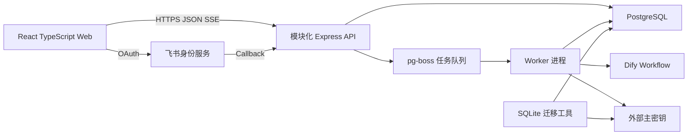

# 小说分析系统重构设计

状态：已完成逐节评审

日期：2026-07-16

适用仓库：`git@github.com:fuer121/Novel-Analysis.git`

## 1. 设计摘要

本次重构将当前本地单用户小说分析工具升级为面向 5 至 20 人的局域网协作系统

重构后的默认主链路为：书库建立 -> L1 章节路由 -> L2 专项事实索引 -> L2 连续提问分析

现有模板分析能力不删除，但降级为书籍工作区内的高级分析入口，不继续占据产品首要心智

新系统采用模块化单体架构，前端升级为 React + TypeScript，后端升级为 TypeScript，使用 PostgreSQL 同时承载业务数据与持久化任务队列，API 与 Worker 作为不同进程运行

Dify 继续承载章节获取、L1、L2、分章分析与汇总分析工作流，新后端负责认证、权限、任务编排、数据、新鲜度、恢复、审计与可观测性

新仓库内完成完整重构，旧系统在开发期间继续稳定运行但不做双写和长期双版本维护，数据验证通过后一次切换

## 2. 当前系统审计结论

### 2.1 已形成的有效能力

当前系统不是简单的模型调用界面，而是已经形成四层可复用数据管线

```text
章节密文库 -> L1 章节路由 -> L2 专项事实库 -> Analysis 结果
```

必须保留的有效能力包括

- 章节原文只导入一次，使用 AES-256-GCM 加密存储
- 使用 HMAC 标识正文版本，不保存普通明文 hash
- L1 负责章节路由，L2 负责专项事实，两者职责分离
- 一本书可维护多个独立 L2 索引组
- Prompt、Schema、索引选择与执行签名参与新鲜度和结果复用
- L2 提问仅查询 L2 facts，不读取原文，不运行逐章分析
- L2 提问按章节窗口扫描，避免候选上限只覆盖全书前段
- 大型结果支持分块、恢复、保真 merge 与降级结果
- 任务支持暂停、取消和 SSE 进度更新
- 结果支持表格化、Markdown 和诊断信息展示
- 仓库维护五条核心 Dify Workflow

### 2.2 当前结构性问题

代码结构已经超过继续局部堆叠的合理边界

- `server/workflows.js` 约 6872 行，混合导入、索引、召回、预算、merge、持久化和恢复
- `server/db.js` 约 2667 行，在模块加载时创建 SQLite 单例并执行手工迁移
- `src/App.jsx` 约 611 行，集中管理路由、基础数据、四类任务和 SSE
- `AnalysisPage.jsx`、`LibraryPage.jsx`、`PromptLibraryPage.jsx` 均接近或超过千行
- `test/service.test.js` 约 7903 行并包含 112 个测试，定位和隔离成本高
- 路由、服务端状态、表单和任务状态均由页面手工管理
- 任务只存在内存 Map，服务重启后 live task 和 SSE 上下文丢失
- App 只恢复每种类型最新的一个任务，无法正确呈现多人并行任务
- SQLite 单例和单进程写入模型不适合 5 至 20 人并发
- 在线 Dify DSL 与仓库 YAML 缺少自动版本一致性校验
- L2 提问的范围、意图、候选窗口、预算裁剪和降级原因尚未完整产品化

### 2.3 当前规模约束

最近项目基线记录的正式数据规模约为

- 4 本书
- 3937 章
- 3034 条 L1 章节索引
- 8692 条 L2 章节状态
- 67465 条 L2 facts
- 15 个索引组
- 288 个 Analysis runs
- SQLite 文件约 211.5 MB

重构不能以重建全部章节和索引为默认迁移方案

## 3. 已确认产品决策

| 决策项 | 确认结果 |
| --- | --- |
| 产品主链路 | 书库建立、L1、L2、L2 提问分析 |
| 模板分析定位 | 保留为高级分析次级入口 |
| 用户模型 | 5 至 20 人局域网协作 |
| 权限模型 | 共享书库和索引，管理员管理成员与高风险操作 |
| 登录方式 | 飞书身份登录 |
| 数据迁移 | 书籍、章节、L1/L2、Prompt 完整迁移，旧分析历史只读归档 |
| 数据准备交互 | 分阶段推进，导入完成后可自动进入 L1，L2 由用户选择 |
| L2 提问 | 支持连续追问，每轮重新召回事实并保存独立证据 |
| 前端基座 | React + TypeScript，正式路由、服务端状态、表单校验与设计系统 |
| Dify 定位 | 继续作为核心工作流执行层 |
| 上线方式 | 新仓库完整重构，验收后一次切换，不长期双维护 |
| 后端方案 | 模块化单体 + PostgreSQL + PostgreSQL 持久化任务队列 |
| 视觉方向 | D 明亮知识工作台 |

## 4. 目标与非目标

### 4.1 目标

- 让成员在单一书籍工作区完成数据准备、提问、审阅和高级分析
- 将批量执行范围、覆盖缺口、真实召回和降级行为完整展示给用户
- 支持多人同时浏览、提交提问和运行受控的后台索引任务
- 将导入、L1、L2 和分析统一为持久化、可恢复、可审计的任务
- 保留现有章节和索引资产，并通过确定性校验证明迁移完整性
- 固化现有有效业务语义，再替换巨型编排与前端状态结构
- 建立清晰模块边界，使每个模块可独立理解、测试和替换

### 4.2 非目标

- 不建设公网 SaaS、多租户计费或开放注册
- 不引入书籍级 ACL，不为不同团队隔离书籍
- 不在首版引入微服务、Kubernetes 或 Redis
- 不在本次重构中替换 Dify 五条核心工作流
- 不在本次重构中引入向量数据库或 embeddings
- 不把旧 Analysis run 转换为可续跑的新任务
- 不提供小说正文阅读器
- 不长期维护新旧系统双写或功能同步

## 5. 目标架构



系统保持一套仓库、一个领域模型和一个 PostgreSQL 数据源

API 与 Worker 分进程是为了隔离请求响应和长任务执行，不代表拆成独立微服务

PostgreSQL 同时承载业务数据与 `pg-boss` 队列，避免为当前规模额外引入 Redis

## 6. 仓库与模块组织

```text
apps/
  web/                 React + TypeScript 前端
  api/                 HTTP、飞书登录、SSE、权限和管理入口
  worker/              pg-boss Worker 与任务执行入口

packages/
  contracts/           Zod API、事件与任务契约
  domain/              书库、索引、提问、权限领域规则
  database/            PostgreSQL 查询、事务和版本化 migration
  jobs/                任务、步骤、租约、幂等与并发策略
  dify-client/         Workflow 适配、版本与错误归一化
  crypto/              加密、HMAC 与密钥接口
  ui/                  设计 token 与可复用交互组件
```

前端在 `apps/web/src` 内按产品能力组织

```text
apps/web/src/features/
  books/
  data-preparation/
  query-sessions/
  advanced-analysis/
  task-center/
  admin/
```

### 6.1 依赖方向

- API 负责身份、权限、参数契约与响应映射
- Domain 负责业务规则，不直接依赖 Express、SQL、Dify 或浏览器
- Repository 负责 PostgreSQL 查询、事务和数据映射
- Jobs 负责任务生命周期、步骤、attempt、租约和并发键
- Worker 负责领取任务并调用应用服务
- Dify Client 负责目标 API Key、请求、重试、输出归一化和上游标识
- Crypto 负责加密、HMAC 和密钥适配，不允许调用者接触密钥内容
- Web 只通过 API 契约访问服务端，不复制后端业务规则

### 6.2 技术组件

前端采用

- React Router 管理正式路由与嵌套路由
- TanStack Query 管理服务端状态、缓存和失效
- React Hook Form 与 Zod 管理表单和输入契约
- TanStack Table 管理高密度表格
- Radix primitives 提供对话框、菜单、抽屉和无障碍基础
- Lucide React 提供统一图标
- 本地 UI 包实现视觉方向 D，不引入大型主题框架

后端采用

- Node.js + Express + TypeScript
- Kysely 类型化 SQL 层
- PostgreSQL 版本化 migration
- `pg-boss` 持久化任务队列
- Zod 共享请求、响应、任务事件和配置契约

最终 SQL 层必须支持显式事务、可审查 migration 和可测试 Repository，不采用隐藏 SQL 与迁移行为的重量 ORM

## 7. 产品信息架构

### 7.1 全局协作层

全局导航收敛为

- 书库
- 任务中心
- 系统管理

系统管理仅对管理员开放，包含

- 成员
- Dify 与模型集成
- 并发和任务配置
- 系统诊断
- 审计日志

### 7.2 书籍工作区

进入一本书后保持稳定书籍上下文，书内导航为

- 概览
- 数据准备
- 提问分析
- 高级分析
- 索引与模板设置

用户不需要在书库、模板和分析三个全局页面之间反复重新选择书籍

### 7.3 默认进入路径

- 未选择书籍时进入共享书库
- 选择已准备书籍后默认进入最近使用的提问会话或提问分析首页
- 选择未准备书籍后默认进入数据准备，并定位到第一个未完成阶段
- 管理员和成员都能看到当前书籍的准备状态与团队任务

## 8. 核心页面设计

### 8.1 共享书库

共享书库使用高密度列表或表格，不使用装饰性卡片墙

每本书直接展示

- 书名与来源 ID
- 章节数量
- L1 覆盖率
- L2 索引组数量与缺口
- 是否可提问
- 最近任务与操作人
- 最近更新时间

主操作是新建书籍和进入书籍工作区

### 8.2 数据准备

数据准备以三个稳定阶段呈现

1. 章节库
2. L1 路由
3. L2 事实

章节导入完成后可按用户启动时的明确选择自动进入 L1

L2 不自动全量建设，用户必须选择索引组、章节范围和构建模式

每次批量运行前展示真实 scope

- 书籍
- 章节范围与具体章节数量
- 索引组
- 构建模式
- 新鲜、缺失、失败和预计跳过数量
- Prompt 与 Workflow 版本
- 创建人和预计队列位置

运行后在原位置展示真实完成、失败、跳过、重试和缺口

### 8.3 L2 连续提问

桌面端采用三栏结构

- 左栏：研究会话列表
- 中栏：连续问答、结果和输入框
- 右栏：本轮索引、召回、章节、覆盖、证据和缺口

每轮问题都创建独立 query turn，并重新执行 L2 召回

精简会话上下文只用于理解代词、省略和追问意图，上一轮模型回答不能成为事实源

回答中的事实必须能够回到本轮 `turn_evidence`

用户可以查看结构化结果、Markdown、证据明细、相关章节和降级原因，不需要跳回书库或诊断页

### 8.4 高级分析

高级分析保留现有模板能力，包括 `fast_index`、`balanced`、`precision` 和 `full_text`

高级分析不出现在全局主导航，只在书籍工作区作为次级入口

新系统创建的高级分析使用新任务模型，旧 Analysis 历史仅通过只读归档入口查看

### 8.5 任务中心

任务中心展示团队所有任务

- 类型
- 书籍
- 真实 scope 摘要
- 创建人
- 状态和进度
- 队列位置
- 已用时间和预计剩余时间
- 当前步骤
- 重试次数
- 失败摘要

成员可暂停、继续或取消自己创建的任务

管理员可控制所有任务并调整并发配额

## 9. 视觉与交互设计系统

视觉方向采用 D 明亮知识工作台

### 9.1 视觉原则

- 浅色导航与白色工作区为主
- 使用细边界和稳定网格建立层次，不依赖浮动卡片和大阴影
- 钴蓝用于主操作和链接
- 绿色只表示健康、完成和可用
- 琥珀表示缺口、待确认和降级
- 红色表示失败、删除和不可逆风险
- 内容审阅区保持较长行文可读性，操作区保持高密度
- 不使用装饰性渐变、彩色光斑或营销式大标题

### 9.2 交互原则

- 上下文稳定：选定书籍后不重复选书
- 范围透明：执行前后都展示真实 scope
- 原位审阅：回答、证据、引用和诊断在当前页面完成
- 任务不中断：切页和刷新不影响后台执行
- 历史可比较：会话轮次、任务和配置版本可以对比
- JSON 可读：优先表格和结构化展示，原始 JSON 作为降级视图
- 中文优先：用户可见文案使用自然中文，字段与协议名除外
- 无布局漂移：工具栏、计数、表格和任务状态使用稳定尺寸

### 9.3 响应式边界

- 1440 和 1280 像素宽度为主要高密度工作台
- 768 像素将证据侧栏转换为可固定抽屉
- 390 像素保留查询、结果阅读和任务查看，复杂索引配置采用分步表单
- 表格允许受控横向滚动，不压缩到不可读

## 10. 领域数据模型

### 10.1 协作与认证

| 对象 | 责任 |
| --- | --- |
| `users` | 本地成员、状态、名称和角色 |
| `auth_identities` | 飞书用户标识与本地用户映射 |
| `sessions` | 服务端登录会话、过期与撤销 |
| `audit_logs` | 高风险操作、配置修改和任务控制审计 |

### 10.2 书库与索引

| 对象 | 责任 |
| --- | --- |
| `books` | 共享书籍元数据和总体状态 |
| `book_sources` | 章节来源配置与非密钥标识 |
| `chapters` | 章节元数据、HMAC 和正文密文 |
| `index_groups` | L2 专项索引定义、范围、Prompt 和启用状态 |
| `l1_indexes` | 章节路由、输入签名和状态 |
| `l2_chapter_statuses` | 每组每章构建状态与输入签名 |
| `l2_facts` | 检索元数据与加密事实内容 |
| `l2_subjects` | 经验证专项主体与 Prompt 隔离信息 |
| `prompt_versions` | L1、L2 和高级分析 Prompt 的不可变版本 |
| `workflow_versions` | Dify 目标、声明版本和导出 DSL hash |

### 10.3 提问与分析

| 对象 | 责任 |
| --- | --- |
| `query_sessions` | 一本书内的研究会话、创建人与标题 |
| `query_turns` | 每轮问题、状态、配置快照、回答密文和 source stats |
| `turn_evidence` | 本轮使用的 L2 fact 引用、排序和召回原因 |
| `analysis_runs` | 新系统高级分析任务与快照 |
| `analysis_parts` | 新高级分析的分章和汇总恢复点 |
| `legacy_analysis_runs` | 旧 Analysis 历史只读归档 |

### 10.4 任务

| 对象 | 责任 |
| --- | --- |
| `jobs` | 类型、状态、创建人、scope、配置快照和并发键 |
| `job_steps` | 可恢复执行单元、输入签名、输出引用和租约 |
| `job_attempts` | 每次执行、上游标识、错误分类和耗时 |
| `job_events` | 持久化进度、警告和终态事件 |
| `job_outbox` | 在业务事务提交后可靠投递 `pg-boss` 消息 |

敏感正文、事实、证据和分析结果继续加密存储

用于检索和诊断的派生元数据仍视为敏感数据，需要磁盘、备份和访问边界保护

## 11. 持久化任务模型

### 11.1 统一状态

```text
queued -> running -> completed
             |  |
             |  +-> retrying -> running
             +----> paused -> running
             +----> failed
             +----> cancelled
```

暂停在当前外部请求结束后的步骤边界生效

取消保留已验证并落库的章节和索引，不把部分成功表述为整体完成

### 11.2 恢复与幂等

每个步骤包含

- 业务 scope
- 输入签名
- 幂等键
- 预期输出引用
- lease owner 与 lease expiry
- attempt 数量
- 当前状态

Worker 重启后重新领取过期租约

已完成步骤只有在输入签名和输出引用仍匹配时才复用

同一书籍、索引组、章节和执行签名的重复任务使用并发键阻止或合并

`jobs`、`job_steps` 和 `job_events` 是产品任务状态的唯一真相源

`pg-boss` 只负责投递和唤醒 Worker，不向前端直接暴露状态

API 在同一 PostgreSQL 事务中写入业务任务与 `job_outbox`，dispatcher 将 outbox 消息投递到独立 `pgboss` schema，成功后标记 outbox 已投递

### 11.3 并发策略

- 不同书籍可并行
- 同一本书的不同 L2 索引组可并行
- 同一章节和索引组的相同执行签名不能并行
- Provider 并发上限由管理员配置
- Query 与后台索引使用独立配额，避免长时间索引阻塞交互提问
- 数据库事务只覆盖本地状态变更，不跨越 Dify 网络调用

### 11.4 事件投影

SSE 继续用于浏览器实时更新，但事件源改为持久化 `job_events`

浏览器刷新、切页或 API 进程重启后可以从数据库恢复任务列表和最近事件

## 12. 四步主链路

### 12.1 书库建立

1. 成员创建书籍并确认来源 ID、书名和章节范围
2. API 展示真实导入 scope 并创建 Import job
3. Worker 按配置批次调用 Dify chapter workflow
4. 每章计算 HMAC、加密并写入 PostgreSQL
5. 已存在且输入签名匹配的章节跳过
6. 导入完成后根据创建任务时的显式选项自动创建 L1 job

### 12.2 L1 路由

1. 任务冻结 Prompt 版本、Workflow 版本和执行签名
2. 每章比较正文 HMAC、Prompt hash 和执行签名
3. 新鲜章节跳过，缺失或过期章节进入步骤队列
4. Worker 调用 Dify L1 Workflow
5. 输出归一化、校验并写入 `l1_indexes`
6. 书籍工作区实时展示覆盖、失败和过期数量

### 12.3 L2 事实

1. 成员选择索引组、章节范围和 `all / missing / retry_failed`
2. 系统展示新鲜、缺失、失败和预计跳过数量
3. 任务冻结索引组 Prompt 版本和 Workflow 版本
4. Worker 按章读取正文密文和紧凑 L1 路由
5. 调用 Dify L2 Workflow 并执行后端准入规则
6. facts 加密写入，检索元数据明文保存
7. 专项主体、状态和覆盖率在同一事务边界更新

`missing` 与 `retry_failed` 不能因 force 扩大执行范围

### 12.4 L2 连续提问

1. 用户选择或创建 query session
2. 每轮提交问题、章节范围和一个或多个 L2 索引组
3. 系统创建 query turn 和 Query job
4. Worker 构建精简会话意图，不把旧回答当事实
5. 按章节窗口读取候选 facts
6. 执行实体、别名、类别、关键词、集合意图和覆盖策略
7. 将最终使用的 fact 引用写入 `turn_evidence`
8. 调用 Dify summary Workflow
9. 保存回答密文、source stats、trace、缺口和执行版本
10. UI 原位显示回答、证据、章节与降级状态

单目标、集合查询和普通查询继续使用独立召回策略

现有硬编码领域词逐步移入有版本的召回策略模块，但本次重构不同时引入 embeddings

## 13. Dify 与执行版本

五类目标保持

- chapter import
- L1 index
- L2 index
- analysis chapter
- analysis summary

每次任务保存

- Dify target
- API Base 标识
- Workflow 声明版本
- 当前导出 DSL hash
- Prompt version
- 执行签名
- 上游 workflow run ID 或可用等价标识

仓库 YAML 不是线上行为的唯一真相

上线前必须从当前 Dify 导出真实 DSL，计算 hash 并与登记版本关联

线上 DSL 变化但版本未更新时，系统在管理员页面报警并阻止无提示地复用旧索引

## 14. 飞书认证与权限

### 14.1 登录流程

1. 浏览器进入固定 HTTPS 域名
2. 未登录用户跳转飞书 OAuth
3. 飞书回调到 API
4. API 校验 state、code 和飞书用户身份
5. 仅当飞书身份已映射到启用的本地成员时创建 session
6. session 使用服务端存储和 `HttpOnly + Secure + SameSite` Cookie

能登录飞书不等于自动获得系统访问权

首个管理员通过部署配置一次性初始化

### 14.2 权限

普通成员可以

- 查看共享书库、索引、任务和结果
- 创建书籍
- 运行导入、L1、L2 和分析任务
- 创建提问会话
- 创建和修改 Prompt 与索引组
- 暂停、继续和取消自己创建的任务

管理员额外可以

- 管理成员与角色
- 修改 Dify、模型、并发和系统配置
- 管理所有任务
- 删除书籍、索引组和历史数据
- 查看完整审计与系统诊断

Prompt 和索引组修改必须生成新版本并记录修改人

## 15. 安全设计

- 章节正文、L2 fact、证据和结果使用 AES-256-GCM
- 主密钥不进入 PostgreSQL、浏览器、任务事件和普通日志
- 密钥接口允许当前 Keychain 和未来受控 secret store 适配
- API Key 只在服务端配置，前端只读取脱敏状态
- OpenAI 或 Dify 请求不记录正文和完整 Prompt
- 错误响应统一脱敏 app key、sk key、Bearer token 和敏感文本
- PostgreSQL 只允许应用网络访问，备份和服务器磁盘加密
- 所有高风险删除、配置变更、成员变更和任务控制写审计日志
- Cookie 会话支持过期、撤销和管理员强制下线
- 状态修改接口执行 CSRF 防护和来源校验
- 系统仍只允许可信局域网或 VPN 访问，不直接暴露公网

## 16. 异常、降级与恢复

### 16.1 失败分类

| 类型 | 行为 |
| --- | --- |
| 输入或权限错误 | 任务创建前拒绝并给出字段级提示 |
| 配置或认证错误 | 不自动重试，提示目标 Dify 配置 |
| 网络、限流和临时上游错误 | 退避重试并记录 attempt |
| 输出 Schema 错误 | 执行受控修复或标记当前步骤失败 |
| 内容不足 | 返回明确缺口，不生成伪事实 |
| Worker 中断 | 租约过期后从持久化步骤恢复 |

### 16.2 L2 提问降级

Dify 汇总不可用时允许生成本地保真事实摘录

降级结果必须显示

- 降级标记
- 失败原因
- 召回事实数
- 涉及章节
- 索引组与缺口
- 是否使用分块 fallback

降级结果不能使用与正常模型回答相同的成功状态文案

### 16.3 删除保护

- 正在被任务使用的书籍和索引组不能删除
- 删除前显示关联章节、facts、会话、任务和高级分析数量
- 高风险删除仅管理员可执行
- 删除操作写入审计日志

## 17. 迁移与切换

### 17.1 迁移对象

完整迁移

- 书籍
- 章节密文、HMAC 和元数据
- L1 索引
- L2 章节状态、facts 与专项主体
- 索引组
- Prompt 与配置

只读归档

- 旧 Analysis run
- 旧结果
- 旧 Prompt 快照
- 旧 source stats 和 trace

不迁移

- 内存任务 Map
- SSE 连接
- 未落库的外部请求状态

### 17.2 迁移方法

迁移工具只读打开 SQLite 快照

敏感密文采用进程内解密、校验并使用目标密钥重加密，不生成明文中间文件

每次迁移生成 manifest，记录来源数据库标识、表计数、按书籍与索引组计数、时间范围、失败项和目标 migration 版本

迁移支持幂等 upsert，允许在正式切换前多次对快照演练

### 17.3 校验门槛

- 章节数量 100% 一致
- 章节 HMAC 100% 一致
- 所有章节密文可解密
- L1 按书籍和状态计数一致
- L2 按书籍、索引组和状态计数一致
- 所有 L2 fact 密文可解密并通过目标 Schema 校验
- Prompt 与索引组数量和内容 hash 一致
- 旧 Analysis 归档数量一致且可读取
- 关键 L2 golden queries 的召回覆盖不低于旧系统基线

任何硬性校验失败都阻止正式切换

### 17.4 正式切换

1. 完成至少一次全量快照迁移和团队 UAT
2. 等待旧系统 live task 归零
3. 旧系统进入维护模式并停止写入
4. 生成旧 SQLite、密钥和配置的不可变备份
5. 执行最终增量迁移
6. 运行全部数据校验和核心 smoke test
7. 切换固定域名或反向代理入口
8. 进入 2 小时受控观察期，暂缓大批量重建
9. 观察期通过后停止旧服务，保留只读历史备份

开发期间不双写，切换后不承诺把新系统数据同步回旧系统

观察期出现严重故障时可以切回旧服务，观察期内新产生的提问会话和任务作为待处理增量单独保留

## 18. 测试设计

### 18.1 旧行为契约

现有 112 个测试按以下领域拆分

- import
- l1
- l2
- query
- analysis
- provider
- storage

神奇生物准入、L2 召回、执行签名、加密、分块 merge 和降级结果建立固定样例

测试拆分先保持行为不变，再为新架构重写实现

### 18.2 测试层次

1. 单元测试覆盖领域规则、权限、范围、召回、幂等键和状态机
2. 契约测试覆盖 API、任务事件、Dify 输入输出、Prompt 和 Workflow 版本
3. 集成测试使用真实 PostgreSQL、migration、事务、`pg-boss` 和加密读写
4. Playwright 端到端测试覆盖登录、建书、导入、L1、L2、连续提问、高级分析和任务中心
5. 故障测试覆盖 Worker 重启、Dify 超时、重复回调、暂停、取消、续跑和迁移中断

### 18.3 前端视觉验证

- 1440、1280、768 和 390 像素视口截图
- 检查导航、表格、工具栏、任务进度和长文本无重叠
- 检查三栏工作区在桌面稳定，在窄屏正确转换为抽屉
- 检查最长中文书名、索引名、任务状态和错误文案不溢出
- 检查键盘导航、焦点、对比度和对话框可访问性

## 19. 验收标准

### 19.1 数据与行为

- 迁移校验门槛全部通过
- 关键 L2 查询召回覆盖不低于旧系统
- Dify 五类工作流契约测试通过
- 旧分析历史可查看但不能错误续跑

### 19.2 任务可靠性

- Worker 在导入、L1、L2 和提问分块中被终止后可以恢复
- 恢复不产生重复 Dify 调用或重复 facts
- 暂停、继续、取消和 retry 语义符合持久化状态
- 浏览器刷新、切页和 API 重启后任务仍可见

### 19.3 多人性能

- 20 个登录用户可同时浏览
- 10 个用户可同时提交提问
- 后台索引按 Provider 配额排队，不阻塞交互查询队列
- 普通 API 在目标数据规模下局域网 `p95 < 500ms`
- 任务提交 `p95 < 1s`
- 状态更新在 2 秒内出现在任务中心

### 19.4 权限与安全

- 普通成员不能管理成员、修改集成配置或执行高风险删除
- 所有关键修改和控制操作有审计记录
- PostgreSQL、日志、任务事件和错误响应中不出现章节正文、L2 fact 明文或密钥
- 飞书身份未进入本地白名单时不能访问系统

### 19.5 用户体验

- 用户可在单一书籍工作区完成建书、L1、L2 和提问
- 每次批量执行前显示真实 scope
- 每轮提问原位显示回答、证据、章节和缺口
- 页面切换不导致任务消失
- 结构化结果优先表格化，原始 JSON 为降级视图
- 目标视口无重叠和不可操作区域

### 19.6 工程门槛

- lint 通过
- TypeScript 类型检查通过
- 单元测试通过
- PostgreSQL 集成测试通过
- Playwright 通过
- 生产构建通过
- migration 校验通过
- `git diff --check` 通过

## 20. 建议交付阶段

这些阶段描述产品切片，不替代后续逐文件实施计划

### 阶段 0：行为契约与工程骨架

- 拆分旧测试并建立 golden cases
- 建立 workspace、TypeScript、contracts 和 CI
- 固化当前 Dify 真实 DSL 与版本 hash

### 阶段 1：协作与基础设施

- PostgreSQL schema 与 migration
- 飞书登录、成员、session、RBAC 和审计
- pg-boss、任务、步骤、attempt、事件和 Worker
- 新设计系统与全局壳

### 阶段 2：书库与数据准备

- 书库与书籍工作区
- 章节导入
- L1
- L2 索引组、构建、覆盖和事实审阅

### 阶段 3：L2 连续提问

- query session 与 turn
- 每轮召回、证据快照和 Dify 汇总
- 三栏工作区
- 降级、trace 和历史比较

### 阶段 4：高级分析与旧历史

- 新任务模型上的高级分析
- 旧 Analysis 只读归档
- 结构化结果和导出

### 阶段 5：迁移、UAT 与切换

- SQLite 迁移工具
- 全量校验与性能测试
- 多人 UAT
- 正式切换与观察期

## 21. 主要风险与控制

| 风险 | 控制 |
| --- | --- |
| 重构时改变现有 L1/L2 语义 | 先固化契约与 golden cases，再替换实现 |
| Dify 在线 DSL 与仓库 YAML 漂移 | 保存 DSL hash、版本和管理员告警 |
| PostgreSQL 迁移丢失或破坏密文 | 全量解密校验、HMAC 比对和 manifest |
| 连续对话把旧回答当事实 | 每轮重新召回，旧上下文只做意图消歧 |
| 多人重复启动相同任务 | concurrency key、幂等键和 scope 预览 |
| 后台索引挤占交互查询 | 独立队列配额与管理员并发配置 |
| 模块化单体再次膨胀 | 强制依赖方向、模块 API 和分层测试 |
| 飞书登录成功即越权 | 本地成员白名单和服务端 RBAC |
| 切换后无法无损回滚新写入 | 2 小时受控观察，暂缓大批量写任务并保留增量 |

## 22. 设计完成定义

本设计在以下条件同时满足时进入实施计划阶段

- 用户已确认架构、信息架构、主链路、迁移、安全、代码组织、视觉方向和测试门槛
- 文档不存在占位内容、开放式架构分叉或相互矛盾的迁移策略
- 实施计划能够将每个阶段拆为可独立验证的任务
- 任何影响旧数据、Dify 语义或上线切换的变更都有明确验收门槛
