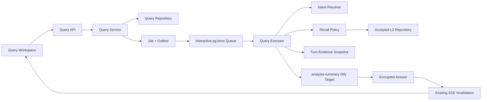

# Phase 3 L2 连续提问设计

## 1. 目标

Phase 3 交付以一本书和一个 L2 索引组为稳定上下文的研究会话，让成员能够连续提问、每轮重新召回事实，并在当前工作区核验采用证据、候选事实、章节范围、缺口、执行 Trace 与降级状态

独立演示必须完成两轮连续提问，第二轮能够理解追问，但旧回答不能成为事实源，每轮结果都能追溯到本轮不可变证据快照

## 2. 已确认决策

| 主题 | 决策 |
| --- | --- |
| 索引组 | 每个研究会话固定绑定一个 L2 索引组 |
| 章节范围 | 会话保存默认范围，单轮可临时缩小但不能扩大 |
| 连续上下文 | 只读取最近三轮用户问题和结构化意图摘要，不读取旧回答正文 |
| Dify | 复用现有 `analysis-summary` target，不新增第六个 Workflow |
| 工作区 | 桌面采用会话左栏加问答/证据上下分屏 |
| 证据 | 默认展示采用证据，候选召回与淘汰原因通过相邻标签查看 |
| Dify 失败 | 沿用 provider 重试，耗尽后由用户选择再次调用或生成本地摘要 |
| 执行资源 | Query 使用独立交互队列与并发配额，复用现有 Job 内核 |
| 架构 | 新增独立 Query 垂直模块，复用现有 L2 repository、加密、Job、lease、outbox 与 SSE |
| 会话可见性 | 默认仅创建人和管理员可见，创建人可主动切换为团队共享 |
| 共享权限 | 团队成员可查看共享会话并新增自己的 turn，只有创建人和管理员可管理会话设置 |

## 3. 范围

### 3.1 包含

- 研究会话创建、列表、重命名与归档
- 单轮问题提交、范围预览、幂等创建、取消与安全重试
- 最近三轮用户问题与结构化意图摘要
- 单目标、集合和普通查询召回策略
- 章节窗口扫描、实体、别名、类别、关键词和覆盖缺口处理
- 本轮候选与采用证据快照
- `analysis-summary` Dify 汇总与用户选择的本地事实摘要
- 独立交互队列配额和 10 用户并发验收
- 回答、证据、候选、缺口、Trace 与降级状态原位展示
- 桌面、平板与移动端响应式工作区

### 3.2 不包含

- 多索引组会话或单轮跨索引组召回
- embeddings、向量数据库或新的检索基础设施
- 第六个 Dify Workflow 或线上 DSL 变更
- 高级分析、新 `analysis_runs` 或旧 Analysis 历史迁移
- 正式 SQLite 数据迁移、部署、切换或线上数据操作
- 基于旧模型回答的事实补全
- 事实删除、会话硬删除或级联删除

## 4. 架构

Phase 3 采用独立 Query 垂直模块，由 Query API、Query Service、Recall Policy、Query Executor 和 Query Repository 组成

Query 模块只通过已接受的公共边界读取书籍、索引组、覆盖率和 L2 facts，不把会话语义写回 Phase 2 索引模块

Query job 继续使用现有 PostgreSQL Job、JobStep、transaction、lease、outbox、pg-boss、幂等键和 SSE 机制，新增交互队列容量而不复制任务基础设施

## 5. 数据边界

### 5.1 `query_sessions`

保存书籍、单个 L2 索引组、默认起止章节、创建人、`private` 或 `team` 可见性、加密会话标题、创建时间、更新时间和归档时间

数据库约束必须保证默认章节范围有效，服务层必须确认索引组属于同一本书

会话归档后禁止新建 turn，但历史回答和证据仍可读取

### 5.2 `query_turns`

保存会话、创建人、加密问题、实际章节范围、结构化意图快照、状态、加密回答、召回统计、缺口、配置快照、执行签名、降级状态、Job 引用和时间信息

实际章节范围必须位于会话默认范围内

结构化意图只允许目标实体、别名、查询类型、指代关系和范围，不允许答案、事实结论或旧回答片段

状态最小集合为 `queued`、`running`、`awaiting_fallback`、`completed`、`degraded`、`failed` 和 `cancelled`

### 5.3 `turn_evidence`

保存 turn、L2 fact 引用、候选排序、召回原因、`used` 或 `excluded` 结论、淘汰原因和引用顺序

一个 turn 的证据快照提交后不可被后续召回覆盖

再次调用 Dify 或生成本地摘要复用同一证据快照，只新增执行 attempt，不重写召回结果

## 6. API 与权限

API 保持书籍上下文，最小能力包括会话列表、创建、读取、重命名、归档，turn preview、创建、读取、取消、Dify 重试和本地摘要

所有写请求继续使用现有 Feishu session、服务端 RBAC、CSRF 和 idempotency key

私有会话只对创建人和管理员可见，创建人可将整个会话切换为团队共享，不提供成员级 ACL

团队成员可查看共享会话并新增自己的 turn，但只能取消或重试自己创建的 turn

只有会话创建人和管理员可以重命名、切换可见性或归档会话，管理员继续保留全部会话与任务的管理权限

turn preview 必须返回书籍、索引组、会话默认范围、本轮实际范围、可查询章节数、覆盖缺口、执行版本和预计队列位置

创建 turn 时必须提交 preview scope hash，范围或索引版本变化后旧 hash 失效并要求重新确认

## 7. 每轮执行流程

1. 用户创建或选择研究会话
2. 用户提交问题和可选的缩小章节范围
3. API 校验 preview scope hash，并在一个事务内创建 turn、Query job、JobStep 与 outbox
4. 交互队列 Worker 读取最近三轮用户问题，生成不含事实的结构化意图
5. Recall Policy 根据单目标、集合或普通查询选择策略，并按章节窗口扫描候选 facts
6. Worker 写入全部候选 `turn_evidence`、采用或淘汰原因、召回统计和缺口
7. Worker 只把本轮问题、结构化意图和采用事实发送到 `analysis-summary`
8. 成功回答加密保存，turn 进入 `completed`
9. SSE 使会话、turn、证据和任务 projection 失效并刷新

旧回答正文不会进入意图输入、召回输入、Dify 输入或证据集合

## 8. 召回策略

Phase 3 保留三种显式策略，不用一个通用 Prompt 猜测全部行为

### 8.1 单目标

目标实体与别名优先，保留所有目标事实后再补充强相关事实，章节窗口不能在命中早期候选后提前结束

### 8.2 集合查询

按类别、结构字段、关键词和章节覆盖选取候选，结果必须跨章节窗口并有全局候选上限

### 8.3 普通查询

使用结构字段、关键词和覆盖策略召回，不得把宽泛问题误识别成虚假目标实体

旧系统 golden cases 只作为行为基线，Phase 3 不复用旧 SQLite 存储或旧 Analysis 运行模型

## 9. 汇总、重试与降级

`analysis-summary` 输入只包含问题、结构化意图、采用事实、章节引用、回答格式和预算信息

`analysis-summary` transient retry 在 Dify adapter 边界最多执行三次，与已接受的真实 Dify smoke 容错边界一致，Query 层不叠加另一套隐式重试

重试耗尽后 turn 进入 `awaiting_fallback`，保留证据快照并提供两个明确动作

- 再次调用 Dify：复用同一证据快照，创建新的执行 attempt
- 生成本地事实摘要：只基于采用事实生成 Markdown，turn 进入 `degraded`

无匹配事实时直接返回明确的无证据结果，不调用 Dify，不允许模型自由回答

失败、降级和缺口必须是用户可见状态，不能使用正常完成样式掩盖

## 10. 并发、恢复与幂等

Query job 使用独立交互队列和配置化并发配额，索引任务不能占满全部交互容量

第一阶段验收为 10 个用户可同时提交问题，重复请求由 idempotency key 合并，同一 turn 的重复 wake、lease recovery 和 outbox replay只能产生一个有效结果

证据快照与 turn 状态在事务边界内提交，旧 Worker 的迟到结果不能覆盖新 attempt 已提交的结果

队列隔离只改变容量和路由，不引入新的任务状态机、lease 实现或消息系统

## 11. 安全与隐私

- 会话标题、问题和回答按用户内容加密
- L2 fact 正文继续通过已接受 repository 解密边界读取
- 普通数据库列、scope、progress、events、outbox、attempt errors 和日志不得包含问题、回答、fact 正文或凭证
- 结构化意图与召回统计只保存允许的元数据
- Dify payload 不包含旧回答正文
- 所有错误持久化为稳定错误码，原始 provider error 不进入普通持久化或日志
- 授权 API 才能返回解密问题、回答和采用事实

## 12. 工作区交互

桌面端保留会话左栏，右侧上方为连续问答和固定输入区，下方为可调整高度或收起的本轮证据区

证据区使用采用证据、候选召回和执行 Trace 三个相邻标签，默认打开采用证据

候选召回展示排序、召回原因、采用或淘汰结论和淘汰原因

移动端使用单层会话抽屉，问答保持主区域，证据固定在底部并可展开，不要求用户跳回书库或诊断页

切换会话、书籍页或其他视图时任务继续运行，返回后通过服务端状态恢复，不依赖页面本地状态

## 13. 测试与验收

### 13.1 契约

- 会话只能绑定一个属于当前书籍的索引组
- 单轮范围只能等于或缩小默认范围
- 问题、回答和会话标题只以密文持久化
- 意图快照拒绝事实字段和旧回答正文
- preview scope hash 在范围或索引版本变化后失效
- 私有会话拒绝其他成员读取或创建 turn
- 共享成员可创建和管理自己的 turn，但不能修改会话设置或管理他人 turn

### 13.2 召回 golden cases

- 单目标、集合和普通查询不低于旧系统基线
- 后段章节事实不会因早期候选上限而漏召回
- 第二轮指代理解使用问题上下文，但重新生成独立证据
- 上一轮回答中的虚构内容不能出现在候选或采用证据

### 13.3 恢复与安全

- transaction rollback 不留下孤立 turn、job 或 evidence
- lease recovery、outbox replay、重复请求与迟到结果保持一个有效结果
- provider 原始错误含明文 sentinel 时，HTTP、events、outbox、attempts、普通列和日志仍不泄漏
- API/Worker 重启后会话、turn、证据和任务状态一致

### 13.4 交互与规模

- 10 个用户并发提交 Query job 时，交互队列不被索引任务占满
- 1440、1280、768 和 390 像素视口无重叠和根级横向滚动
- 回答、采用证据、候选、缺口、Trace 与降级动作原位可用
- 页面切换后任务持续且返回时状态恢复

## 14. 阶段 Gate

Phase 3 计划必须将实现压缩为 6 至 8 个可独立验证任务，并保留以下高风险细节

- 数据库 transaction 与密文边界
- Query lease recovery 与迟到结果
- outbox replay 与幂等
- 旧回答隔离和错误脱敏
- 独立交互队列的 10 用户并发

`GATE-PHASE3-PLAN-APPROVED` 通过前不得开始 Phase 3 编码

Phase 3 完成也不授权正式数据迁移、部署、旧系统切换或 Phase 4 实施
