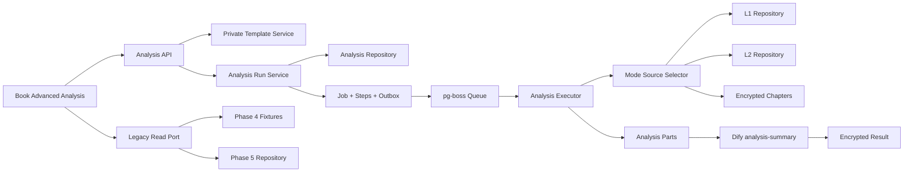

# Phase 4 高级分析与旧历史设计

## 1. 目标

Phase 4 将旧系统的模板分析能力迁移到新 PostgreSQL、Job 和 Worker 内核，同时在书籍工作区提供旧 Analysis 历史的只读入口

独立演示必须完成一次新高级分析的创建、后台执行、恢复、结构化查看与导出，并能打开一条 fixture 旧历史记录且无法对其执行任何写操作

## 2. 现状审计

| 链路 | 旧实现 | 新系统可复用能力 | Phase 4 处理 |
| --- | --- | --- | --- |
| 入口 | `src/pages/AnalysisPage.jsx` 全局分析页 | `BookWorkspacePage` 与稳定应用壳 | 改为书籍工作区次级入口 |
| 模板 | SQLite `prompt_groups`，按书籍绑定索引组 | `prompt_versions` 与索引组版本 | 新建私有 `analysis_templates` 与不可变版本 |
| 运行 | `server/workflows.js` 进程内大函数 | PostgreSQL Jobs、JobSteps、lease、outbox、pg-boss | 原生重建，不 import 旧运行时 |
| 模式 | `fast_index`、`balanced`、`precision`、`full_text` | L1/L2 repository 与章节解密边界 | 保留旧读取边界和默认复核预算 |
| 快照 | 加密 Prompt 快照、hash 与章节选择 | 加密内容、workflow versions 与 config snapshot | 扩展为完整来源与执行快照 |
| 恢复 | 章节和 summary part 局部复用 | JobStep lease recovery 与幂等状态机 | 以 `analysis_parts` 作为业务恢复点 |
| 结果 | JSON、Markdown、表格与安全诊断 | Query 工作区的原位结果模式 | 保留结构化优先与原始 JSON 降级 |
| 导出 | Markdown、Excel 兼容文件、JSON | 客户端下载能力 | 原样迁移，不新增服务端文件存储 |
| 旧历史 | SQLite `analysis_runs` 及关联表 | 尚无正式迁移器 | 只定义只读 port 与 fixture adapter |

旧 `server/workflows.js`、`server/db.js`、旧 Analysis 页面和既有 service tests 只作为行为审计与 golden baseline，不成为新应用依赖

## 3. 已确认决策

| 主题 | 决策 |
| --- | --- |
| 实现路线 | 契约优先的原生重建，不包装或复制旧运行时 |
| 旧历史 | Phase 4 使用只读契约、port 与 fixtures，真实 SQLite 导入留在 Phase 5 |
| 四种模式 | 保留名称、读取边界与默认复核预算，算法优化不进入 Phase 4 |
| 模板 | 按书籍管理，仅创建者可见和编辑，更新产生不可变版本 |
| 新任务可见性 | 仅创建者可读取模板、任务内容、parts、结果与诊断 |
| 管理员 | 可查看安全任务元数据并控制任务，不可读取内容 |
| 旧历史交互 | 与新任务同页，使用独立只读视图和 API |
| 删除 | 创建者可硬删除自己的终态新任务，审计日志独立保留 |
| 删除状态 | 仅 `completed`、`failed`、`cancelled` 可删除，活动任务必须先取消并等待终态 |
| 导出 | 文本导出 Markdown，可表格化 JSON 导出 Excel 兼容文件，其他结构导出 JSON |

## 4. 范围

### 4.1 包含

- 私有的书籍分析模板与不可变模板版本
- `analysis_runs` 与 `analysis_parts`
- `fast_index`、`balanced`、`precision`、`full_text`
- Prompt、Schema、索引组、章节与执行版本快照
- 分章、召回、原文复核、字段拆分、分层汇总和保真 merge
- 暂停、继续、取消、lease recovery 与 part 复用
- 创建者终态硬删除与独立审计证据
- 旧历史只读 contract、repository port、fixture adapter 与 Web 视图
- 结构化表格、Markdown、JSON 降级视图与兼容导出
- 书籍工作区高级分析入口和响应式适配

### 4.2 不包含

- 正式 SQLite 连接、旧数据迁移或 `legacy_analysis_runs` 正式导入
- 新 Dify Workflow、DSL 修改或新的外部依赖
- 四种模式的算法、预算或召回策略优化
- 全局团队模板库、模板发布、共享或成员级 ACL
- 团队共享分析结果
- XLSX、CSV、批量导出或服务端文件仓库
- 旧历史暂停、续跑、取消、删除或修改
- Phase 5 的部署、UAT、切换和正式数据操作

## 5. 架构

Phase 4 采用独立 Advanced Analysis 垂直模块，并通过既有公共边界读取书籍、章节、L1、L2、加密、Dify、Job 与事件能力

模块只增加必要公共契约，不修改 Phase 2 索引语义或 Phase 3 Query 语义

## 6. 数据模型

### 6.1 `analysis_templates`

保存书籍、创建者、名称、当前版本引用、绑定索引组、创建时间与更新时间

列表和详情查询必须按创建者过滤，管理员也不能读取模板正文

### 6.2 `analysis_template_versions`

模板版本保存加密 Prompt、输出 Schema、内容 hash、绑定索引组版本和创建时间

模板更新新增版本并切换当前引用，不修改旧版本。历史 run 始终引用创建时版本

使用分析专用版本表保存加密模板内容，不扩展当前以明文 `content` 服务 L1/L2 的 `prompt_versions`。禁止复制模板明文到普通 Job 字段

### 6.3 `analysis_runs`

保存书籍、创建者、模板版本、Job、模式、章节范围、状态、执行签名、加密最终结果、安全诊断摘要和时间信息

业务状态与 Job 状态显式映射，Job 是队列和控制状态的权威，run 是分析内容和结果的权威

### 6.4 `analysis_parts`

保存 run、位置、kind、输入签名、状态、加密结果、错误代码、输出引用和时间信息

`full_text` 以章节处理和分层汇总 part 为主，三种索引模式以召回、原文复核和分层汇总 part 为主

part 只有在结果密文完整提交后才能进入 completed，已完成且输入签名一致的 part 可在恢复时复用

### 6.5 旧历史只读模型

公共模型只包含旧记录 ID、书籍引用、名称、章节范围、旧状态、结果、诊断、创建时间和更新时间，并固定返回 `readOnly: true` 与 `canResume: false`

Phase 4 不创建正式旧数据导入器。fixture adapter 与 Phase 5 repository 必须实现同一个只读 port

## 7. 不可变运行快照

创建 run 时一次性锁定以下内容

- 模板版本、Prompt、Schema 与内容 hash
- 分析模式和兼容复核预算
- 书籍、章节 ID、范围与内容 HMAC
- 索引组 ID、配置 hash、L1/L2 输入版本
- workflow target、contract version 与 DSL hash
- 模型、reasoning effort 和执行器版本

模板后续更新、章节变化或索引重建不能静默改变已创建 run。续跑只使用原快照，签名失效时必须明确失败或重建对应 part，不能改用当前配置伪装续跑

敏感 Prompt、Schema、part 输出、最终结果和原文派生内容继续加密存储。普通 columns、scope、progress、events、outbox、attempt errors、审计与日志不得包含这些明文

## 8. 创建、执行与恢复

### 8.1 创建事务

一个数据库事务内完成成员、书籍、模板与索引组归属校验，创建 run、Job、JobSteps、created event、outbox wake 和审计日志

任一写入失败全部回滚。相同创建者与 idempotency key 重放返回同一任务，相同 key 携带不同请求内容返回冲突

### 8.2 模式输入边界

- `fast_index` 只读取兼容范围内的 L1/L2，不读取原文
- `balanced` 在索引召回后按旧默认预算复核少量原文章节
- `precision` 在索引召回后按旧默认预算复核更多原文章节
- `full_text` 逐章读取原文并分层汇总

旧 golden cases 必须证明读取边界和默认预算未发生漂移

### 8.3 执行单元

新执行器拆为来源选择器、part 执行器、分层汇总器和最终结果校验器，不复制旧大函数结构

暂停在当前外部调用完成后的 step 边界生效，取消阻止后续 step 但保留已提交 parts，Schema 校验失败的结果不得标记 completed

### 8.4 恢复与幂等

Worker 继续使用现有 lease recovery、attempt、outbox replay 和迟到结果保护

lease 过期后只恢复未完成 step，已完成且签名一致的 part 不重跑，重复 wake 只能产生一个有效结果

## 9. 权限与安全

| 操作 | 创建者 | 其他成员 | 管理员 |
| --- | --- | --- | --- |
| 查看或编辑模板 | 是 | 否 | 否 |
| 创建分析 | 使用自己的模板 | 使用自己的模板 | 使用自己的模板 |
| 查看分析内容和结果 | 是 | 否 | 否 |
| 查看安全任务元数据 | 是 | 否 | 是 |
| 暂停、继续、取消 | 是 | 否 | 是 |
| 硬删除终态新分析 | 是 | 否 | 否 |
| 查看旧历史内容 | 按只读授权 | 否 | 否 |

管理员元数据只允许 Job ID、创建者、书籍 ID、状态、进度、稳定错误代码和资源占用，不返回 Prompt、Schema、原文、part、结果、provider payload 或可逆内容指纹

所有 API 在查询层实施资源不可见策略，不能只依赖前端隐藏。其他成员无法枚举私有模板或 run ID

## 10. 硬删除

只允许创建者删除自己的 `completed`、`failed` 或 `cancelled` 新分析。`queued`、`running`、`retrying` 与 `paused` 必须先取消并等待 Worker 进入终态

删除事务锁定 run 与 Job，重新验证创建者、终态和资源归属，写入独立审计日志后级联删除 run、parts、JobSteps、attempts、events、outbox 和 Job

审计日志保留操作者、目标 ID、删除前状态和时间，不保存分析明文，也不随业务记录级联删除。任一步失败则整个事务回滚

旧历史不进入删除路径，API 不提供旧历史 mutation route

## 11. API

模板 API 提供私有列表、创建、详情和更新，更新产生新版本

新分析 API 提供 scope preview、幂等创建、私有列表、详情、parts 进度、暂停、继续、取消、终态删除和结果读取

旧历史 API 只提供列表和详情，公共路由层不存在 pause、resume、cancel、delete 或 update handler

管理员任务控制继续使用既有安全 Job control 边界，不通过分析内容 API 获得额外权限

## 12. 前端交互

高级分析是书籍工作区次级入口，不加入全局主导航

页面顶部使用“新任务”和“旧历史”分段视图，左侧为私有模板与任务列表，主区负责创建、进度、结果和诊断。768 与 390 像素视口将左侧转换为抽屉

创建前原位展示当前书籍、模板版本、模式、章节范围、索引组、原文读取边界、预计复核范围和快照提示

任务详情从服务端恢复状态，展示真实进度、当前步骤、parts 统计、控制动作、结构化表格、Markdown、原始 JSON 降级视图、安全诊断和兼容导出

终态任务显示不可恢复的删除确认，活动任务不显示删除入口

旧历史视图明确标记“旧系统只读”，不显示任何写操作，并清楚说明 Phase 4 演示使用 fixture 数据而非正式旧库

## 13. 结果与导出

结果优先转为结构化表格，无法稳定表格化时展示 Markdown 或格式化 JSON，原始 JSON 始终只作为降级视图

文本结果导出 Markdown，可表格化 JSON 导出既有 Excel 兼容文件，其他结构化结果导出 JSON

Phase 4 不增加 XLSX、CSV、批量导出、服务端文件生成或持久文件仓库

## 14. 错误处理

- 模板、run 或旧历史不属于当前用户时统一返回资源不可见
- 模板版本、章节 HMAC 或索引版本失效时明确失败，不静默改用当前版本
- Dify 暂时失败只沿用 adapter 与 Job attempt 的既有重试边界
- part 永久失败保存稳定错误代码和安全诊断，不持久化原始 provider error
- 暂停、取消、完成竞态只允许一个状态转换提交
- 删除与 Worker 竞态通过终态校验和行锁阻断
- plaintext 与 credential sentinel 扫描覆盖数据库、普通 API JSON、captured API/Worker logs、events、outbox、attempt errors 和受控 provider error

## 15. 验收

### 15.1 契约与模式

- 私有模板和 run 拒绝其他成员与管理员读取内容
- 管理员只能读取安全任务元数据并控制任务
- 四种模式读取 L1、L2 与原文的边界和默认预算与旧 golden cases 一致
- Prompt、Schema、索引、章节和执行版本快照不随模板修改漂移
- 旧历史响应固定只读且不存在 mutation route

### 15.2 事务与恢复

- 创建失败不留下孤立 run、Job、Step、event 或 outbox
- outbox replay、重复请求和重复 wake 只产生一个有效 run
- lease recovery 只重跑未完成或签名失效的 part
- 暂停、取消、完成和迟到结果竞态保持合法终态
- 硬删除只接受创建者的终态新分析，业务数据原子删除且审计保留

### 15.3 交互与安全

- 页面刷新和切换后任务持续，返回时状态恢复
- 新任务与旧历史在同页分区但使用独立 API 和操作集
- 表格、Markdown、JSON 与三类兼容导出可用
- 1440、1280、768 和 390 像素视口无重叠和根级横向滚动
- 数据库、HTTP、events、outbox、attempts、日志和 provider error 不泄漏敏感明文或凭证

## 16. 风险与控制

| 风险 | 控制 |
| --- | --- |
| 迁移时改变四种模式语义 | 先固化 golden cases，再实现新执行器 |
| 模板修改污染历史续跑 | 不可变版本、完整快照与执行签名 |
| part 与 Job 状态双重权威 | Job 管控制，run/part 管内容，显式状态映射 |
| 管理员控制导致内容越权 | 独立安全元数据 projection，不调用内容详情 API |
| 硬删除与 Worker 竞态 | 只允许终态、行锁复验和单事务级联 |
| 旧历史提前依赖 SQLite | Phase 4 只实现只读 port 与 fixture adapter |
| 复制旧大函数导致新模块膨胀 | 四个单一职责执行单元和公共 repository 边界 |

## 17. 阶段 Gate

Phase 4 实施计划必须压缩为 6 至 8 个可独立验证任务，并保留数据库事务、内容加密、outbox 幂等、lease recovery、管理员无内容权限和终态硬删除六类高风险验证

`GATE-PHASE4-PLAN-APPROVED` 通过前不得开始 Phase 4 schema、migration、生产代码或前端实施

Phase 4 完成也不授权正式旧数据迁移、部署、UAT、切换或线上操作
