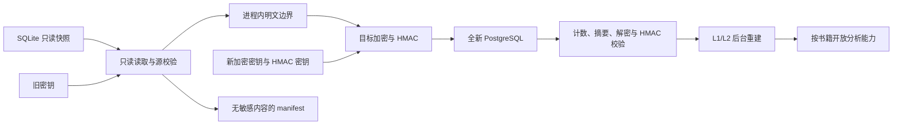

# Phase 5 迁移、性能、UAT 与切换设计

## 1. 目标与授权边界

Phase 5 为单台固定服务器设计生产规模迁移演练、性能验证、UAT 与一次性切换方案

本设计交付迁移工具、验证证据、UAT 方案和切换手册，不授权访问正式快照、修改正式飞书回调、执行 UAT、部署或正式切换

正式数据、外部配置、部署和切换必须分别通过后续 Gate

## 2. 已确认决策

| 主题 | 决策 |
| --- | --- |
| Phase 5 交付边界 | 完成生产规模演练、性能验证、UAT 方案与切换手册，不在计划 Gate 自动执行正式操作 |
| 迁移范围 | 只迁移书籍、来源信息与章节，不迁移旧 L1、L2、Prompt、Analysis、任务、会话或运行状态 |
| 索引处理 | 使用仓库当前已批准 Prompt、Schema 与 Dify DSL 从零重建 L1/L2 |
| 维护窗口 | 书籍与章节迁移、硬校验、基础 smoke 和入口切换必须在 2 小时内完成，L1/L2 全量重建不受该时限约束 |
| 分析恢复 | 切换后先恢复书库与章节浏览，分析能力按书籍重建完成情况逐步开放 |
| 部署形态 | 反向代理、Web/API、Worker 与 PostgreSQL 部署在单台固定服务器 |
| 回退策略 | 切换前硬失败取消切换，切换后不恢复旧入口，严重故障通过新系统维护模式修复 |
| 旧备份 | SQLite、旧密钥与旧配置保留 90 天，到期销毁必须单独审批并留证 |
| 演练数据 | 使用正式 SQLite 的只读快照，访问、密钥使用、隔离与销毁必须先通过独立 Gate |
| UAT | 3 至 5 名代表用户，覆盖管理员、普通成员与核心分析使用者 |
| 飞书 | 使用正式飞书应用，回调变更必须单独授权并可在窗口内恢复 |
| 正式落地 | 切换当天从空 PostgreSQL 重新迁移，不把演练数据库或快照晋升为正式库 |

## 3. 对既有设计的受控修正

本设计经书面复核并形成 accepted checkpoint 后，取代总体设计 `2026-07-16-novel-analysis-refactor-design.md` 的以下规则

- 第 17.1 节的 L1、L2、索引组、Prompt 与旧 Analysis 迁移要求，改为只迁移书籍、来源信息与章节
- 第 17.3 和 19.1 节中针对旧 L1、L2、Prompt、旧 Analysis 的迁移一致性门槛，改为新系统重建、覆盖与 golden query 门槛
- 第 17.4 和 21 节的观察期旧入口回退规则，改为切换后只通过新系统维护模式修复
- 两小时窗口只约束迁移、硬校验、基础 smoke 与入口切换，不约束 L1/L2 全量重建

其余总体设计、阶段路线、权限、安全、任务恢复和工程验收规则继续有效

## 4. 范围

### 4.1 包含

- SQLite 只读迁移器
- 旧密钥进程内解密、源内容校验和目标密钥重加密
- 稳定 ID 映射与不含敏感内容的 migration manifest
- 书籍、来源信息和章节的事务写入与全量校验
- L1/L2 后台重建状态、恢复、进度与按书籍能力解锁
- 生产规模基础容量测试与受控真实 Dify smoke
- 正式飞书应用 UAT 方案
- 单机部署、维护模式、切换、观察和修复手册

### 4.2 不包含

- 旧 L1、L2、索引组、Prompt 或 Analysis 数据导入
- 旧任务、会话、SSE 或未落库外部请求状态导入
- 长期双写、双入口或新数据回写旧系统
- 新 Dify Workflow、Prompt 语义或索引算法优化
- 集群、高可用数据库或不停机迁移
- 本设计阶段的正式快照访问、密钥操作、飞书配置、UAT、部署或切换

## 5. 迁移架构

SQLite 必须以只读模式打开，迁移进程不得执行 schema 初始化、兼容修复或任何写语句

章节正文只允许在受控进程内存中短暂存在，不得写入日志、临时文件、manifest、普通错误、Job、event、outbox 或 audit payload

## 6. 迁移事务与幂等边界

每本书作为独立迁移事务，事务内完成书籍、来源信息、章节、目标加密字段和 ID 映射写入

单本书任一步失败时整本回滚，禁止留下半本书状态。正式迁移始终从空 PostgreSQL 开始，硬失败后废弃本次目标库并重新执行，不在状态不明的半成品上续跑

旧书籍与章节标识到新 UUID 的映射必须稳定，并写入 manifest 的非敏感映射摘要，使重复演练可以核对同一来源对象

迁移器不得写入 L1、L2、Prompt、Analysis、任务、会话或运行状态

## 7. Manifest 与硬校验

每次运行生成不可变 manifest，至少包含

- 来源数据库不可逆指纹与文件元数据
- 迁移工具版本、目标 schema 版本与运行时间
- 书籍总数、每本章节数、章节范围和迁移状态
- ID 映射摘要、批次耗时、失败对象与稳定错误代码
- 目标解密、HMAC 与内容摘要校验结果

manifest、日志和错误不得包含章节正文、密钥、可逆凭证或 provider payload

以下条件必须 100% 通过

- 书籍数和每本章节数一致
- 章节序号、标题与来源信息一致
- 源章节可以使用旧密钥解密并完成来源完整性校验
- 迁移前后规范化正文内容摘要一致
- 目标章节全部可解密且目标 HMAC 全部通过
- 不存在缺失、重复、越界或跨书籍章节

任一差异都是硬失败，阻止入口切换

## 8. L1/L2 重建与逐步开放

重建只使用仓库当前已批准的 Prompt、Schema 和 Dify DSL，不读取或继承旧 Prompt

每本书具有 `等待中`、`L1 构建中`、`L2 构建中`、`可用` 和 `失败` 五类用户可见状态

默认按最近使用时间排序重建，管理员可以调整尚未开始书籍的顺序。L1 完整通过后才能开始该书 L2

L2 按章节执行并复用现有 lease recovery、幂等、outbox 与重试语义，Worker 重启后只继续未完成步骤，重复 wake 不得产生重复 facts 或重复有效结果

书籍只有在 L1、基础 L2、覆盖率检查和核心 smoke 全部通过后，才能开放 L2 提问与依赖索引的高级分析。未完成书籍可以浏览章节，但分析入口必须禁用并显示真实进度

单本书失败只阻塞该书。正式切换后限制大批量高级分析，避免与索引重建争抢 Dify 配额

演练保存每本书章节数、L1/L2 调用数、重试数、总耗时和失败率，并用固定书籍与问题验证关键事实召回。回答文字不要求逐字一致

## 9. 性能验证

基础容量测试使用与正式数据同规模的 PostgreSQL 和受控 Dify 替身，验证单机 API、Worker、队列和数据库，避免用大量真实 Dify 调用制造成本和配额风险

真实链路只执行受控 Dify smoke，验证输入输出、超时、错误处理、凭证安全和仓库 DSL 身份，不把少量真实调用包装成并发容量证据

验收门槛为

- 20 个登录用户同时浏览时普通 API `p95 < 500ms`
- 10 个用户同时提交提问时任务提交 `p95 < 1s`
- 任务状态在 2 秒内出现在任务中心
- 索引重建和交互提问采用独立队列配额，交互请求优先
- 测试报告记录持续时间、预热方式、数据规模、服务器配置和原始结果

性能失败阻止 UAT Gate，不允许通过降低既有验收标准掩盖问题

## 10. UAT

UAT 使用正式 SQLite 只读快照、正式飞书应用和候选固定域名，由 3 至 5 名代表用户执行

必须覆盖管理员登录、成员登录、未授权身份拦截、书库浏览、章节阅读、重建状态、L2 提问、证据查看、任务恢复和权限拦截

至少选择一本数据量较大的书完成完整 L1/L2 重建和提问验证

阻塞问题必须关闭，非阻塞问题必须记录负责人和处理时间。UAT 通过不等于允许正式切换

快照获取、旧密钥使用、隔离存放、飞书回调变更和数据销毁必须先通过各自 Gate

## 11. 单机部署与安全

固定服务器运行反向代理、Web/API、Worker 与 PostgreSQL。外部只开放 HTTPS，PostgreSQL 与内部服务只监听本机或容器内部网络

飞书正式回调只允许固定 HTTPS 域名和精确 callback path

数据库凭证、旧解密密钥、新加密密钥、独立 HMAC 密钥和 Dify key 不得写入仓库、镜像、前端产物或日志

部署前必须验证磁盘容量、备份空间、CPU、内存、时钟同步、证书续期和密钥可读取性。应用、Worker 与数据库分别提供健康检查，容量不足或依赖异常时禁止开始迁移

## 12. 正式切换

正式切换必须执行以下顺序

1. 通过正式快照、飞书配置、部署与切换 Gate
2. 等待旧系统 live task 归零
3. 旧系统进入维护模式并停止写入
4. 生成 SQLite、旧密钥与旧配置的不可变备份
5. 创建全新 PostgreSQL 并执行全部 schema migration
6. 迁移书籍与章节并运行全部硬校验
7. 运行登录、书库、章节读取和任务提交基础 smoke
8. 在两小时内完成步骤 3 至 7 后切换固定入口，超时或失败则取消切换并继续保持旧系统
9. 切换后启动 L1/L2 后台重建并按书籍逐步开放分析能力
10. 进入两小时受控观察期，监控登录、API、Worker、数据库、队列与错误率
11. 严重故障时进入新系统维护模式修复，不恢复旧入口
12. 旧数据库、密钥与配置保留 90 天，到期经独立审批销毁

由于切换后不恢复旧入口，正式 Gate 必须确认观察期负责人全程在线，并提前验证新系统数据库恢复与修复手册

## 13. Gate 与授权

| Gate | 允许的下一步 | 不自动授权 |
| --- | --- | --- |
| Phase 5 设计 Gate | 编写实施计划 | 编码、正式数据或外部操作 |
| Phase 5 计划 Gate | 按 Task Contract 实施工具与测试 | 正式快照、UAT、部署或切换 |
| 工具验收 Gate | 请求正式快照访问 | 自动取得或复制正式数据 |
| 正式快照访问 Gate | 在批准边界内进行隔离演练 | 正式飞书配置或切换 |
| UAT Gate | 在批准窗口内配置回调并执行 UAT | 正式部署或切换 |
| 正式切换 Gate | 按批准手册执行一次切换 | 扩展范围或改变停止条件 |

## 14. 强制停止条件

- SQLite 被非只读打开
- 出现章节解密、HMAC、计数或内容摘要差异
- 日志、manifest 或临时文件出现正文或密钥
- 书籍与章节迁移、硬校验、基础 smoke 和入口切换超过两小时
- 未完成重建的书籍错误开放分析能力
- L1/L2 重建无法恢复或产生重复索引
- 性能门槛、权限、安全检查或 UAT 未通过
- 正式飞书回调无法在批准窗口内恢复配置
- 服务器容量、备份或值守条件不满足
- 出现任何未授权的正式数据、部署或入口操作

## 15. 设计完成定义

本设计在以下条件同时满足时才可以进入实施计划阶段

- 用户完成书面复核并形成 accepted checkpoint
- 对既有总体设计的修正范围明确且不存在互相冲突的迁移规则
- 迁移、重建、性能、UAT、切换和修复边界都有可验证门槛
- 正式数据、飞书配置、部署和切换均保留独立授权 Gate
- 实施计划可以压缩为 6 至 8 个可独立验证任务
